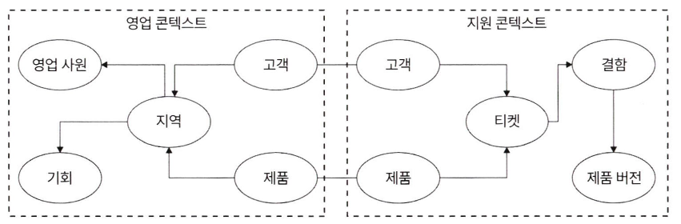
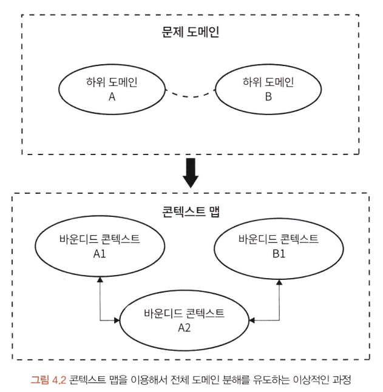
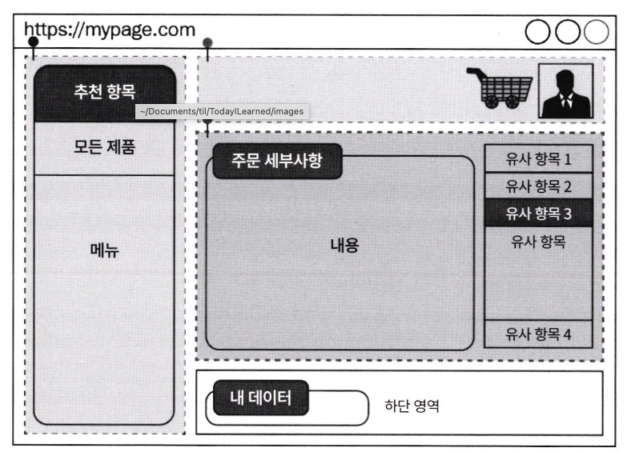

# 도메인 분해

팀 구성을 최대한 활용하려면 마이크로 프론트엔드 범위를 식별하기 위한 전략이 필요하다. 도메인 분해는 범위를 나눌 수 있게 도와준다. 이 장에서 내용이 기술적이지는 않지만, 수행 전 공부를 도와준다.  

이 개념을 완전히 이해하려면 먼저 도메인 주도 설계(DDD) 원칙부터 짚는다. 그 후 관심사 분리를 논하고 기술 전략, 비즈니스 중심 전략을 알아본다. 그 다음 제일 선행되어야 하는 아키텍처 경계에 대해 짚는다.

- 도메인 주도 설계 원칙
- 관심사 분리
- 아키텍처 경계

## 도메인 주도 설계 원칙

다음 두 가지에 대한 청사진으로 도메인 주도 설계를 한다.

- 명확한 경계를 가진 마이크로 프론트엔드에 대한 정의
- 경계를 갖기 위한 전략 수립

### 모듈

과거의 패키지와 같은 말로 이 책에서는 앞으로 모듈 대신 마이크로 프론트엔드라고 부른다. 모듈의 일반적인 설계 원칙은 낮은 결합도, 높은 응집도다. 하나의 문제를 해결하기 위한 단일 유닛이란 뜻이다.  

DDD에서는 어떤 것이 모듈이 될 수 있는지 **<u>바운디드 콘텍스트 개념</u>**을 도입했다.

### 바운디드 콘텍스트

하위 도메인 기능 경계를 정하기 위해 사용한다. 모듈과 비슷해보이지만 다르다. 여러 모듈이 한 바운디드 콘텍스트 안에 포함된다. 콘텍스트 맵 형태로 시각화하기 좋다.

### 콘텍스트 맵

시스템과 관련된 콘텍스트 사이 연결을 설명할 때 유용하다. 어디서 공유하는지, 마이크로 프론트엔드를 어떻게 격리할지 정할 수 있다. 이를 위해 자기완비적 도메인을 식별해야 한다. 여기에 **전략적** **도메인 설계**, **전술적 설계** 두 가지 방법이 있다.

> **자기완비적 시스템**  
> 여러 독립 시스템으로 분리해서 소규모 시스템들을 협동해 완벽한 논리적 시스템을 만드는 아키텍처 접근 방식.

### 전략적 도메인 설계 vs 전술적 설계

- 전략적 도메인 설계

  - 도메인에 대한 지식 확장, 의미있는 기준을 떠올릴 때

  - 도메인들을 식별, 서로 간 소통에 관심

  - 전체 관심 도메인을 작은 하위 도메인으로 세분화할 때 유용. 바운디드 콘텍스트를 도출한다. 그 다음 콘텍스트간의 기록을 콘텍스트 맵에 기록.

    

- 전술적 설계
  - 시스템 구성하는 설계 패턴, 구성 요소를 고려할 때
  - 도메인들 구조화에만 관심

 

## 관심사 분리

마이크로 프론트엔드 초기에는 기술적인 분할에 열광했으나 진정한 이점은 비즈니스 중심 분할에서 나온다. 두 가지 옵션을 살펴본다.

### 기술적 분할

웹 페이지에 선을 그리는 것으로 시작한다. 화면 구성요소들을 각 마이크로 프론트엔드로 만든다. 다른 페이지에서도 재사용할 수 있는 이점이 있다.

### 기능적 분할

기능으로 분할한다. 하나의 마이크로 프론트엔드를 없애도 나머지는 직접 영향을 받지 않는다.

 

<hr/ >

## 아키텍처 경계

아키텍처 경계는 코드 수준으로 넘어온다.

### 공유된 기능

마이크로 프론트엔드에서 두 가지 선택지에서 고민한다.

1. 모든 기능, 코드를 공통 라이브러리나 마이크로 프론트엔드에 넣기  

   장점 : 모든 마이크로 프론트엔드가 각 문제 영역에만 집중할 수 있다. 하지만, 공유 코드 베이스 변경 시 오류를 유발한다.

2. 아무것도 공유하지 않기 - 모든 마이크로 프론트엔드에 복사, 자체 솔루션 구축  

   1이 올바른 접근법이 아니라는 것을 알면 2를 선택할 수 있다. 그러나 모든 것을 복제하다보면 결국에는 비슷한 상황에 놓인다. 한 곳에서 수정을 해야하면 모든 곳에서 수정해야 한다.

**<u>이를 해결하기 위해 안정적인 핵심 기능만 공유해서 1, 2의 절충안을 선택하는 것과 a를 채택하되 각 마이크로 프론트엔드에서 공유 기능을 재정의해서 사용할 수 있게 하는것이다.</u>** 이렇게 하면 오류가 발견된 곳에서 수정이 가능하다. 다음은 공유할 수 있는 기능의 종류다.

- 인증
- 권한
- 피처 플래그
- 기본 사용자 정보
- 내비게이션
- 로깅

### 적절한 자유도 선택하기

- 보안
- 성능
- 팀 구성

성능적으로 좋게 하기 위해서는 초기 렌더링에 필요한 적은  수의 에셋, 마이크로 프론트엔드당 서버 사이드 방식 채택이 도움이 된다.

### 마이크로 프론트엔드의 범용성

마이크로 프론트엔드를 범용적으로 사용할 수 있다면 운이 좋은 상황. 그러나 요구사항과 관련되어 적절한 균형을 찾아야 된다.