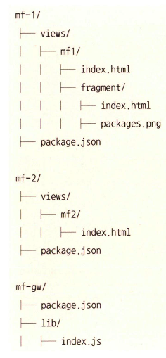

# 웹 접근 방식

- 웹 접근 방식의 기본
- 장단점
- 링크
- iframe 태그

## 웹 접근 방식의 기본

웹 접근 방식으로 마이크로 프론트엔드를 구현하는 방법은 **<u>URL을 통해 개별 마이크로 프론트엔드를 참조한다.</u>**

### 아키텍처

웹 접근 방식은 기본적으로 마이크로 서비스와 거의 동일한 아키텍처를 사용한다. 그러나, HTML 형태로 미리 렌더링 된다. 데이터는 기존 API 서버를 이용해 읽는다.

### 예제 구현

항상 모노레포를 이용했지만, 이 예제의 경우 각 마이크로 프론트엔드가 자체 저장소에 상주하는 것을 가정한다. 일반적으로 각 개별 저장소가 필요하지만, 이 예제에서는 별도 디렉터리를 만든다.  

웹 접근 방식에서 모든 마이크로 프론트엔드는 완전한 웹 서버다. 데모목적으로 정적 HTML을 제공하는 http-server 패키지 기반 Node.js 프로젝트를 만들어본다.

### 구조



```js
// mf-gw/lib/index.js

const express = require("express");
const { createProxyMiddleware } = require("http-proxy-middleware");

const app = express();
const port = process.env.PORT || 1234;

const targets = {
  "/mf1": "http://localhost:2001",
  "/mf2": "http://localhost:2002",
};

app.get("/", (_, res) => res.redirect(Object.keys(targets)[0]));

Object.keys(targets).forEach((prefix) => {
  console.log(prefix, targets[prefix]);
  app.use(
    prefix,
    createProxyMiddleware({
      target: targets[prefix],
      changeOrigin: true,
      logLevel: "debug",
    })
  );
});

app.get("*", (_, res) => res.status(404).send("Page not found."));

app.listen(port, () => {
  console.log(`Microfrontend gateway running at ${port}.`);
});
```


- mf-1

```json
// mf-1/package.json
{
  "name": "mf-1",
  "version": "1.0.0",
  "description": "",
  "main": "index.js",
  "scripts": {
    "start": "http-server ./views --port 2001",
    "test": "echo \"Error: no test specified\" && exit 1"
  },
  "keywords": [],
  "author": "",
  "license": "ISC",
  "devDependencies": {
    "http-server": "^0.12.3"
  }
}

```

```html
<!-- mf-1/views/index.html -->

<!DOCTYPE html>
<html lang="en">
  <head>
    <meta charset="UTF-8" />
    <meta name="viewport" content="width=device-width, initial-scale=1.0" />
    <title>MF-1</title>
  </head>
  <body>
    <h1>This is microfrontend 1.</h1>
    <a href="/mf2">Go to MF2</a>
  </body>
</html>

```

- mf-2

```json
// mf-2/package.json

{
  "name": "mf-2",
  "version": "1.0.0",
  "description": "",
  "main": "index.js",
  "scripts": {
    "start": "http-server ./views --port 2002",
    "test": "echo \"Error: no test specified\" && exit 1"
  },
  "keywords": [],
  "author": "",
  "license": "ISC",
  "devDependencies": {
    "http-server": "^0.12.3"
  }
}
```

localhost:1234 로 들어가면 localhost:2001이 호출되서 mf1의 index.html이 나오고 a 링크를 누르면 /mf2가 호출되지만 프록시 서버에 의해 localhost:2002가 호출된다.


<br />

## 장단점

이 접근법의 주요 장점은 단순하다는 것. 프레임워크와 관련 없다. 이게 단점이 되기도 하는데, 일관된 사용자 경험을 주기 어렵다. 즉, 일관된 경험이 필요없을 때 사용하기 적합하다. 따라서, 쿠키 동의 솔루션, 채팅 봇 등을 만들 때 이미 이런 형태의 마이크로 프론트엔드를 활용하고 있다.

### 중앙 연결 디렉터리

중앙 연결 디렉터리 접근 방식은 마이크로 프론트엔드 애플리케이션들의 라우팅을 한 곳에서 중앙 집중적으로 관리하는 방식이다. 중앙 연결 디렉터리를 통해 마이크로 프론트엔드 경로와 대상 서버 정보를 등록하고, 이를 기반으로 라우팅 및 프록시 설정을 관리합니다. 일관성과 중앙 집중적인 관리가 가능하다.

### 로컬 연결 디렉터리

각 마이크로 프론트엔드 애플리케이션 자체에서 라우팅 및 프록시 설정을 관리하는 방식. 이 방식의 장점은 개별 마이크로 프론트엔드 애플리케이션에 대한 제어권이 높다는 것이다.