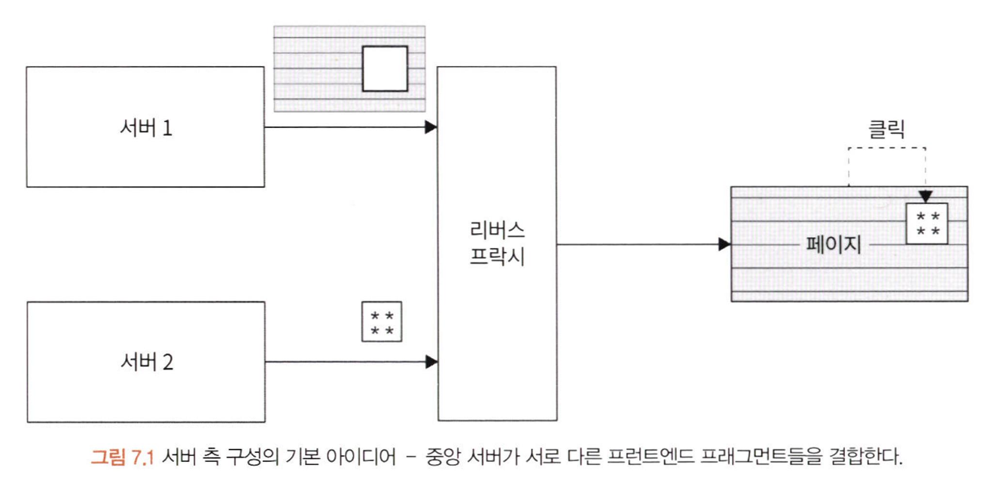

# 서버 측 구성

6장에서 간단한 방법으로 마이크로 프론트엔드를 구성했다. 그러나, 이런 간단한 솔루션은 규모 변경이 어렵다. 마이크로 프론트엔드에서 규모 변경은 가장 중요한 요소 중 하나다.  

그렇다면, 규모 변경성에 대해 제약없이 가능하게 하기 위해서 격리 및 분리하고 독립된 상태를 유지하려면 어떻게 해야 할까?  

**한 가지 답은 서버 측 구성(Server-side composition)패턴에서 찾을 수 있다.** 그러나 이 패턴은 백엔드에 추가적인 복잡성이 들어간다. 서버 측 구성은 다양한 소스의 뷰를 동적으로 결합할 수 있고, 공유 저장소가 전혀 필요 없는 수평적 마이크로 프론트엔드를 가능하게 한다.  

이번 장에서는 다음 주제를 다룬다.

- 서버 측 구성의 기본
- 장단점
- 구성 레이아웃 만들기
- 마이크로 프론트엔드 프로젝트 설정하기

---

## 기술적인 요구 사항

Node.js, Express에 대한 지식

 

---

## 서버 측 구성의 기본

마이크로 프론트엔드를 구현하는 서버 측 구성은 마이크로 프론트엔드를 결정하는 **백엔드의 중심점이 필요**하다. 

리버스 프락시, 게이트 웨이 서비스 또는 BFF(Backend For FrontEnd)라고 한다. BFF는 프론트엔드를 제공하기 위해 도입된 백엔드 일부다. BFF는 개별 리소스를 결합해서 페이지를 제공한다.

### 아키텍처

위 사진에서 보이는 리버스 프락시. BFF부분은 완전히 렌더링된 페이지를 생성하기 위해 하나의 파일로 만드는 `집계 레이어`다. 집계 레이어에서는 **URL로 식별되는 현재 페이지를 템플릿과 연관짓도록 결정하는 작업이 가장 중요**하다. 

### 예제

ESI를 이용해서 동적으로 웹 콘텐츠를 추가하는 예제가 나온다.

> **ESI**  
>
> CDN을 이용하여 웹 콘텐츠의 동적 include를 가능하게 하는 프레임워크. ESI보다는 GraphQL, RESTful API같은 API기반 접근 방식이 더 선호되는 경향이 있다.

---

## 장단점

서버 측 구성은 마이크로 프론트엔드 구현에 가장 많이 사용되는 패턴 중 하나다. 이유는 **규모 변경이 쉽고 느슨한 결합에 높은 성능을 자랑하기 때문이다. 또한, 동적 생성, 독립적인 개발을 보장한다.**  

하지만, 단점도 있다. 서로 다른 프론트엔드가 단일 페이지로 병합되므로 적절한 격리를 보장할 수 없다. 따라서, **스크립트와 스타일 시트가 서로 충돌한다.**

또한 적절한 디버깅 도구가 부족하다. 