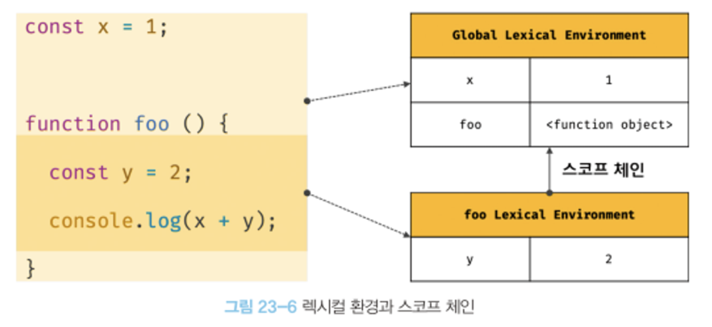
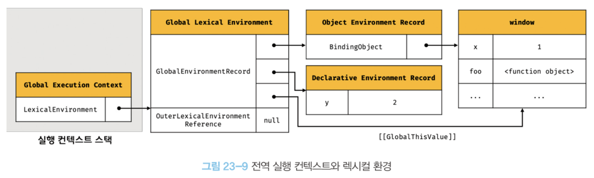

# 실행 컨텍스트

실행 컨텍스트는 JS 동작 원리를 담고 있는 핵심 개념이다. 이해하면 스코프 기반으로 식별자, 식별자의 값을 관리하는 방식, 호이스팅이 발생하는 이유, 클로저 동작 방식, 태스크 큐와 함께 하는 이벤트 핸들러와 비동기 처리를 이해할 수 있다.  

## 소스코드 타입

ECMAScript 사양에서는 code를 4가지로 구분한다.

- 전역 코드 : 전역에 존재하는 소스 코드 (전역에 정의한 함수, 클래스 등 내부는 포함 X)
- 함수 코드 : 함수 내부에 존재하는 소스 코드 (중첩된 함수, 클래스 등 내부는 포함 X)
- eval 코드
- 모듈 코드 : 모듈 내부에 존재하는 소스 코드 (모듈 내부 함수, 클래스 등 내부는 포함 X)

소스코드를 4가지로 구분하는 이유는 타입에 따라 실행 컨텍스트 생성 과정, 관리 내용이 다르기 때문이다.

## 소스코드의 평가와 실행

JS는 소스코드를 2개의 과정을 나눠 처리한다.

1. 소스코드의 **평가**  

   실행 컨텍스트를 생성하고 변수, 함수의 선언문만 먼저 실행해서 실행 컨텍스트가 관리하는 스코프에 등록한다.

2. 소스코드의 **실행(런타임)**  

   소스코드 평가 과정이 끝나면 선언문을 제외하고 순차적으로 실행한다. 실행 결과는 다시 실행 컨텍스트가 관리하는 스코프에 등록된다.

```jsx
var x;
x = 1;
```

**소스코드 평가 과정**에서 `var x;`  코드가 평가되고 실행 컨텍스트에 식별자 x로 등록이 되며 undefined로 초기화된다. 다음으로 **소스코드 실행 과정**에서 스코프에 x가 등록되어 있는지 확인하고 할당한다.

## 실행 컨텍스트의 역할

```jsx
// 전역 변수 선언
const x = 1;
const y = 2;

// 함수 정의
function foo(a) {
  // 지역 변수 선언
  const x = 10;
  const y = 20;

  console.log(a + x + y); // 130
}

// 함수 호출
foo(100);

// 메서드 호출
console.log(x + y); // 3
```

1. 전역 코드 평가  

   전역에 있는 선언문만 먼저 실행한다. 이 때 var 키워드로 선언한 전역 변수, 함수 선언문은 전역 객체의 프로퍼티, 메서드가 된다.

2. 전역 코드 실행  

   런타임이 시작된다. 전역 변수에 **값이 할당되고 함수가 호출된다.** 호출 시 내부로 진입한다.

3. 함수 코드 평가  

   전역과 마찬가지로 실행하기 앞서 매개변수, 지역 변수 선언문, arguments가 지역 스코프에 등록되고 this바인딩이 결정된다.

4. 함수 코드 실행  

   매개변수와 지역 변수에 값이 할당된다.

이런 모든 것을 관리하는 것이 실행 컨텍스트다. **실행 컨텍스트는 소스코드를 실행하는데 필요한 환경을 제공하고 실행 결과를 실제로 관리하는 영역이다.**  

구체적으로 말하면 식별자를 등록하고 관리하는 스코프와 코드 실행 순서 관리를 구현한 내부 메커니즘으로, 모든 코드는 실행 컨텍스트를 통해 실행되고 관리된다.  

**식별자, 스코프는 실행 컨텍스트의 렉시컬 환경으로 관리**하고 코드 실행 순서는 **실행 컨텍스트 스택**으로 관리한다.

## 렉시컬 환경

> 식별자와 바인딩된 값, 상위 스코프에 대한 참조를 기록하는 자료구조

실행 컨텍스트를 구성하는 컴포넌트로 스코프와 식별자를 관리한다.




**렉시컬 환경**은 두 개의 컴포넌트로 구성된다.

- EnvironmentRecord (환경 레코드)  

  스코프에 식별자를 등록하고 값을 관리하는 저장소.

- OuterLexicalEnvironmentRefernece (외부 렉시컬 환경에 대한 참조)  

  상위 스코프를 가리킨다.

## 실행 컨텍스트의 생성과 식별자 검색 과정

```jsx
var x = 1;
const y = 2;

function foo(a) {
  var x = 3;
  const y = 4;

  function bar(b) {
    const z = 5;
    console.log(a + b + x + y + z);
  }
  bar(10);
}

foo(20); // 42
```

1. 전역 객체 생성.  

   전역 코드가 평가되기 전에 생성된다. 빌트인 객체, 클라이언트 사이드면 Web API같은 것들이 들어감.

2. 전역 코드 평가.  

   소스코드가 로드되면 JS엔진은 평가를 시작한다.  

   1. 전역 실행 컨텍스트 생성
   2. 전역 렉시컬 환경 생성 : 전역 실행 컨텍스트에 바인딩.
      1. 전역 환경 레코드 생성 : 전역 변수를 구분하여 관리한다.
         1. 객체 환경 레코드 생성 : var키워드, 빌트인 객체 관리. `BindingObject` 라고 부르는 객체와 연결된다. 이것으로 인해 전역 객체를 가리키는 `window`없이 전역 객체의 프로퍼티를 참조할 수 있는 것이다. (ex. window.alert가 아닌 alert)
         2. 선언적 환경 레코드 생성 : let, const 키워드 관리. 전역 객체의 프로퍼티가 되지 않는다. var와 다르게 선언과 초기화 단계를 분리해서 진행한다. 런타임 시 변수 선언문에 도착하기 전까지 TDZ에 빠진다. 즉, 호이스팅은 동일하게 발생하나 TDZ에 빠져 참조할 수 없는 것. 처음엔 알 수 없는 값 `<uninitialized>` 상태다.(실제값 아님)
      2. this 바인딩 : 전역 환경 레코드의 `[[GlobalThisValue]]` 내부 슬롯에 this가 바인딩된다. 이 내부 슬롯은 전역 환경 레코드와 함수 환경 레코드에만 존재한다.
      3. 외부 렉시컬 환경에 대한 참조 결정 : 상위 스포크를 가리킨다. 현재 예시는 null인데 스코프 체인의 종점을 의미한다.



1. 전역 코드 실행

   x, y 에 값이 할당된다. 그리고 foo함수가 호출된다. 변수 할당문이나 함수 호출문을 실행하려면 변수나 함수 이름이 선언된 식별자인지 확인해야 한다. 이 때 동일한 이름이 여러 스코프에 있을 수 있기 때문에 어떤 식별자를 참조하면 되는지 결정을 해야 한다. 이를 **식별자 결정**이라 한다.  

   식별자 결정을 위해서 실행 중인 컨텍스트에서 식별자를 검색하기 시작한다. 선언된 식별자는 실행 컨텍스트의 렉시컬 환경 - 환경 레코드에 등록되어 있다. 여기서 식별자를 찾아보고 없으면 외부 렉시컬 환경에 대한 참조가 가리키는 상위 스코프(렉시컬 환경)으로 이동해서 식별자를 탐색한다.  

   이것이 바로 스코프 체인의 동작원리다. 이렇게 식별자를 찾다가 찾지 못하면 참조 에러(ReferenceError)를 발생시킨다.

2. foo 함수 평가

   foo 함수가 호출되면 코드의 흐름이 일시 중지되고 함수 내부로 코드의 제어권이 이동한다. 그리고 마찬가지로 평가를 시작한다.  

   1. 함수 실행 컨텍스트 생성

      먼저 foo 함수 실행 컨텍스트를 생성한다. 생성된 foo Execution Context(함수 실행 컨텍스트)는 foo Lexical Environment(함수 렉시컬 환경)이 완성된 다음 실행 컨텍스트 스택에 푸쉬된다.

   2. 함수 렉시컬 환경 생성

      1. foo Lexical Environment 내에 FunctionEnvironment Record(함수 환경 레코드)는 매개변수, arguments 객체, 함수 내부에서 선언한 지역 변수, 중첩 함수를 관리한다.
      2. FunctionEnvironment Record 의 [[ThisValue]] 내부슬롯에 this가 바인딩된다. 이 때 this는 함수 호출 방식에 따라 결정된다. 현 예제에서는 일반 함수로 호출되어 this는 전역객체를 가리킨다.
      3. OuterLexicalEnvironment Reference(외부 렉시컬 환경에 대한 참조)에는 foo 함수가 평가된 시점에 실행 중인 실행 컨텍스트의 렉시컬 환경이 할당된다. 함수를 전역에 정의했기 때문에 전역 렉시컬 환경이 참조된다. (JS는 어디서 함수를 호출했는지가 아니라, 어디서 정의했는지에 따라 상위스코프가 결정) 함수는 평가될 때 함수 객체 내부 슬롯 `[[Envirionment]]` 에 저장한다.

3. foo 함수 코드 실행  

   x, y를 찾아서 값이 할당된다. 그리고 bar함수도 평가되고 실행된다.

4. 종료  

   제일 마지막에 실행된 bar함수부터 실행 컨텍스트에서 제거된다. 이 때 bar함수의 렉시컬 환경까지 제거되지는 않는다. 독립적인 개체이기 때문인데, 누군가에게 참조되지 않을 때 가비지 컬렉터에 의해 해제되어 소멸한다. 만약, 누군가 참조하고 있다면 소멸하지 않는다.