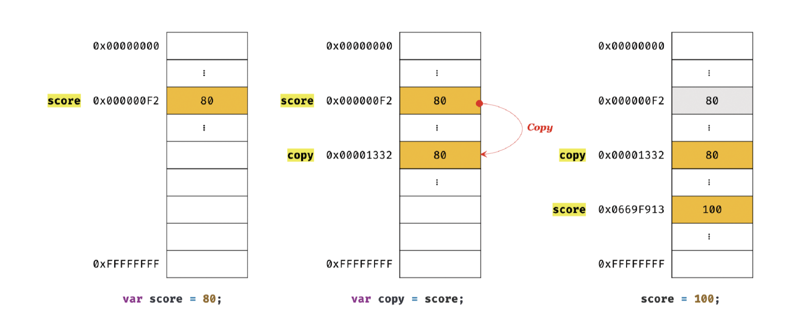
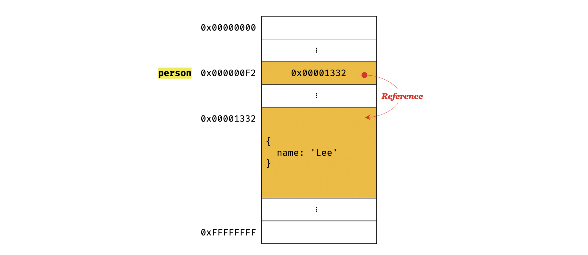
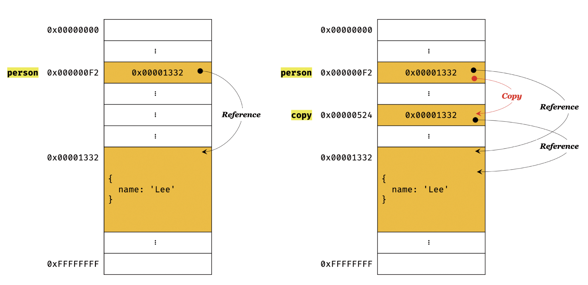

JS에서 제공하는 7가지 데이터 타입(숫자, 문자열, 불리언, null, undefined, 심벌, 객체)타입은 크게 원시 타입과 객체 타입으로 구분할 수 있다. 원시 타입과 객체 타입은 크게 세가지 측면에서 다르다.

- 원시 타입은 변경 불가능하며, 객체타입은 변경가능하다.
- 원시 값을 변수에 저장하면 실제 값이 저장되고, 객체를 변수에 할당하면 참조 값이 저장된다.
- 원시 값을 갖는 변수를 다른 변수에 할당하면 원시 값이 복사되서 전달된다.(값에 의한 전달) 객체를 가리키고 있는 변수를 다른 변수에 할당하면 참조 값이 복사되어 전달된다.(참조에 의한 전달)


## 원시 값

원시 값은 원시 값 자체를 변경 불가능하다는 것이지 변수 값을 변경할 수 없다는 게 아니다. 변수는 언제든지 재할당을 통해서 변수 값을 '교체'할 수 있다. 상수도 메모리에 값을 저장하기 때문에 변수라고 할 수 있고, 재할당이 금지된 변수일 뿐이다.

변수는 재할당하면 메모리에 다른 주소에 있는 원시 값을 가리킨다. 메모리 주소가 바뀌는 것이다. 값의 이런 특성을 **불변성**이라 한다. 원시값은 불변성을 갖고, 이런 원시값을 할당한 변수는 재할당 이외에 값을 변경할 수 있는 방법이 없다.

<br />

### 문자열과 불변성

ECMAScript사양에 따르면 문자열 타입은(2byte) 숫자 타입은(8byte)라고 규정되어있다. 따라서, 문자열은 1개의 문자가 2byte의 메모리 공간에 저장되고 몇 개의 문자냐에 따라 메모리 공간 크기가 결정된다. 숫자는 1도, 100000000도 동일한 8byte가 필요하다.

<br />

### 유사 배열 객체

유사 배열 객체란 배열처럼 인덱스로 프로퍼티 값에 접근이 가능하며, length 프로퍼티를 갖는 객체를 말한다. 문자열은 배열처럼 인덱스로 문자에 접근할 수 있고 length 프로퍼티를 갖고 for문으로 순회도 가능하다.

```js
const str = 'string';

console.log(str[0]) // 's'
console.log(str.length) // 6
console.log(str.toUpperCase()) // 'STRING'
```

원시 값을 객체처럼 접근하면 래퍼 객체로 자동 변환된다.

> 위 예제에서 str[0] = 'S'처럼 값을 변경해도 반영되지 않는다. 문자열은 변경 불가능한 원시 값이기 때문이다. 변수에 재할당하는 것은 가능하다. 기존 문자열을 변경하는 것이 아니라 새롭게 할당하는 것이기 때문이다.

<br />

### 값에 의한 전달

```js
let score = 80;
let copy = score;

score = 100;

console.log(copy); // 80
```



새로운 값 80이 생성되서 copy변수에 할당된다. score === copy를 확인해보면 true가 나오지만 다른 메모리 공간에 값이 있는 것이다.

> 엄격하게 말하면, 변수에는 값이 아니라 메모리 주소가 전달되서 <u>값에 의한 전달</u>이라는 말이 오해를 유발할 수 있다. **변수는 값이 아니라 메모리 주소를 기억하고 있기 때문이다.** 이처럼 값에 의한 전달도 사실은 메모리 주소를 전달하는 것이다. 전달하는 메모리 주소로 메모리 공간에 접근해 값을 참조해온다.

<br />

## 객체

객체는 메모리에 저장되어 있는 '참조값'으로 실제 객체에 접근한다.



```js
const person = {
  name: 'Lee'
};
```

객체는 변경 가능한 값이기 때문에 직접 수정할 수 있다.


> JS의 객체는 크기가 매우 클 수도 있고, 원시 값처럼 크기가 일정하지도 않아서 메모리 효율이나 성능이 좋지 않다. 따라서 메모리를 효율적으로 사용하기 위해, 변경 가능한 값으로 설계되었다. 어느정도 단점을 감안한 설계라 볼 수 있다. 하지만, **이런 구조에 따라서 부작용이 있는데, 여러 개 식별자가 하나의 객체를 공유할 수 있다는 것이다.**

<br />

### 얕은 복사, 깊은 복사

- 얕은 복사(shallow copy)는 한 단계만 복사하는 것이다. 객체에 중첩되어있는 객체는 참조값만 복사한다.

- 깊은 복사(deep copy)는 중첩되어있는 객체까지 모두 복사하는 것을 말한다. 

<br />

### 참조에 의한 전달

```js
const person = {
  name: 'Lee'
}

// 참조 값을 복사했다. => 얕은 복사
const copy = person;
```



**두 식별자가 하나의 객체를 공유한다.**


## 결론

값에 의한 전달, 참조에 의한 전달 모두 복사하려는 **식별자가 메모리에 있는 값을 전달한다는 것은 동일하다.** 하지만, 그 값이 원시 값인지, 참조값인지만 다르다. **따라서 사실 '값에 의한 전달'만 존재한다고 볼 수도 있다.**

> 일치 비교 연산자(`===`)로 비교했을 때 원시값을 할당한 변수는 원시값을 비교하고 참조값을 할당한 변수는 참조값을 비교한다.