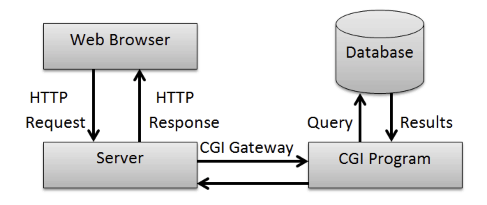

# 10장 : 웹 콘텐츠에서 사용하는 기술

## 웹 서버와 프로그램을 연계하는 CGI

CGI(Common Gateway Interface)는 공통 게이트웨이 인터페이스 약어로, 웹 서버와 외부 프로그램 사이에서 정보를 주고 받는 방법, 규약들을 말한다. 웹 서버의 종류가 여러가지고 프로그램도 엄창나게 많은 프로그램이 존재해서 서로 입출력을 주고 받을 때 표준이 필요하다. 이 표준에 맞춰 만들어진 것이 CGI 스크립트다. 어떤 언어로든 만들 수 있다. 



CGI는 리퀘스트마다 프로그램을 가동해서 대량의 액세스 시에는 부하가 걸린다. 서블릿은 웹 서버와 같은 프로세스 속에서 동작하여 비교적 부하를 적게 먹는다. CGI의 문제점을 해결하는 기술로 Java와 함께 보급되었다. 

## XML

eXtensible Markup Language의 약자로 범용적으로 사용할 수 있는 마크업 언어다. XML로 데이터 공유를 용이하게 하는 것을 목적으로 한다. XML은 흔히 JSON과 비교할 수 있다. 요즘은 데이터 교환을 목적으로는 XML의 대안인 JSON을 사용한다. 구문 길이, 더 빨리 읽고 쓸 수 있고, 배열을 사용할 수 있는 등 더 이점이 많다. 하지만 아직, XML을 사용하고 있는 곳들이 있기도 한다.

```xml
<employees>
  <employee>
    <firstName>John</firstName> <lastName>Doe</lastName>
  </employee>
  <employee>
    <firstName>Anna</firstName> <lastName>Smith</lastName>
  </employee>
  <employee>
    <firstName>Peter</firstName> <lastName>Jones</lastName>
  </employee>
</employees>
```

```json
{"employees":[
  { "firstName":"John", "lastName":"Doe" },
  { "firstName":"Anna", "lastName":"Smith" },
  { "firstName":"Peter", "lastName":"Jones" }
]}
```

<br />

## RSS/Atom

RSS나 Atom은 뉴스, 블로그 등 갱신 정보를 송신하기 위한 문서 포맷의 총칭이다. XML을 이용하고 있다.