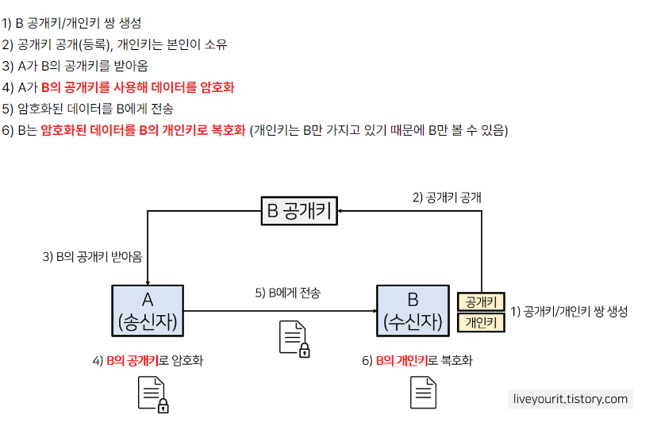

# 7장 : 웹을 안전하게 지켜주는 HTTPS

## HTTP의 약점

HTTP의 단점은 다음과 같다.

1. 평문 통신이기 때문에 도청이 가능하다.
2. 통신 상대를 확인하지 않아 위장이 가능하다.
3. 완전성을 증명할 수 없어 변조가 가능하다.

HTTP만 아닌, 다른 암호화하지 않은 프로토콜도 공통되는 문제점이다.

### 1. 평문이기 때문에 도청 가능하다.

HTTP는 자신을 암호화할 수 있는 기능이 없어서 암호화하지 않는다. 그래서 평문으로 보낸다.

- **TCP/IP는 애초에 도청이 가능한 네트워크다.**  
  TCP/IP의 구조상 통신 도중에 엿볼 수 있다. 인터넷은 세계를 경유하는 네트워크로 되어있다. 즉, 통신 경로의 모든 기기를 내가 소유할 수 없으니 엿볼 수 있다. 엿볼 수 있다는 것은, 암호화된 통신에서도 마찬가지다. 도청하는 일은 흐르고 있는 패킷을 수집하는 것만으로 도청을 할 수 있다. 패킷을 해석하는 패킷 캡처나 스니퍼라는 툴을 사용할 수 있다. 패킷캡처를 사용하면 메서드, 요청, 응답을 볼 수 있다.
- **암호화로 도청에 방지한다.**  
  가장 보급화되어있는 기술은 암호화다.  
  - **통신 암호화**  
    한 가지 방법은 통신을 암호화하는 것. HTTP에는 암호화 구조는 없지만, **SSL(Secure Socket Layer)이나 TLS(Transport Layer Security)같은 다른 프로토콜과 조합해서 통신을 암호화**할 수 있다. **SSL로 안전한 통신로를 확보하고 HTTP통신**을 할 수 있다.
  - **콘텐츠 암호화**  
    다른 한 가지는 콘텐츠 자체를 암호화 할 수 있다. HTTP가 운반하는 내용자체를 암호화하는 것. 이 경우 **클라이언트에서 HTTP메시지를 암호화해야 한다.** 통신 자체는 암호화되어 있지 않다. 물론, 클라이언트와 서버가 암복호화할 수 있는 구조를 가지고 있는 것이 전제가 되어야 한다.

 

### 2. 통신 상대를 확인하지 않기 때문에 위장 가능

HTTP를 사용한 리퀘스트, 리스폰스는 상대를 확인하지 않는다. 즉, 상대가 진짜 URI에서 지정된 호스트인지를 모른다.

- **누구나 리퀘스트 할 수 있다.**  
  누구든지 리퀘스트를 보낼 수 있다. 리퀘스트가 오면 상대가 누구든지 어떤 리스폰스를 반환한다. 물론 서버에서 액세스 제한이 없는 경우 그렇다. 위장한 클라이언트가 될 수도 있고 서버가 될 수도 있다. 따라서 대량의 리퀘스트에 의해 DDOS공격을 방지할 수 없다.
- **상대를 확인하는 증명서**  
  HTTP에서는 통신상대를 확인할 수 없지만 SSL로 확인할 수 있다. 암호화뿐만 아니라 상대를 확인하는 수단으로 증명서를 사용한다. 제3의 기관에서 발행한 증명서를 통해 서버, 클라이언트가 내가 통신하려고 하는 상대인지 확인한다. 이로써 개인정보 누설위험이 줄어들게 된다.

 

### 3. 완전성을 증명할 수 없기 때문에 변조 가능.

**완전성**이란 정보의 **정확성**이다. 증명할 수 없다는 것은, 정보가 정확한지 판단할 수 없다는 것이다.

- 수신한 내용이 다를 수 있다.  
  리퀘스트, 리스폰스가 발신한 후 변조되어도 알 방법이 없다. 변조하는 공격을 **중간자 공격**이라 한다.
- 변조를 방지하려면?  
  확실하면서 편리한 방법은 현재 없다. 자주 사용하는 방법은 MD5, SHA-1등 해시 값을 확인하는 방법과 파일의 디지털 서명을 확인하는 방법이 있다. 어느 쪽을 사용하더라도 클라이언트에서 검증해야 한다. 브라우저가 자동으로 검사하는 것이 아니다. 이렇게 하더라도 완벽하게 검증할 수 있는 것은 아니다. 확실하게 하기 위해서는 HTTPS를 사용해야 한다. SSL은 인증, 암호화, 다이제스트 기능을 제공하고 있다. (다이제스트 인증: 비밀번호를 네트워크를 통해 평문으로 전송하지 않는다! 난스를 비밀번호에 섞어 난스가 바뀔때마다 요약(digest)가 바뀌게 한다.)

 

## HTTP + 암호화  + 인증 + 완전성 보호 = HTTPS

### HTTPS는 SSL 껍질을 쓴 HTTP

HTTPS는 새로운 프로토콜이 아니다. HTTP통신하는 소켓 부분을 SSL, TLS프로토콜로 대체하고 있을 뿐이다. HTTP는 직접 TCP와 통신하지만, SSL을 사용한 경우 HTTP는 SSL과 통신하고 SSL이 TCP와 통신한다. SSL을 사용함으로 **암호화 증명서** 및 **완전성 보호**를 이용할 수 있게 된다.

 

### 상호간 키를 교환하는 공개키 암호화 방식

SSL을 설명하기 전 암호화 방식에 대해 알아본다. SSL에는 **공개키 암호화 방식**이라 불리는 암호화 방식을 쓰고 있다. **공개키 암호화 방식**이란 **비대칭키 암호화라고도 하며, 송수신자가 암, 복호화하기 위해 한 쌍의 비밀키(개인키)와 공개키**를 사용하는 것이다. 공개키를 사용하여 암호화한 데이터를 보내고 받는 쪽에서 비밀키로 복호화한다. **비밀키의 도청을 막기 위해 네트워크로 보내지 않는다.** 

- **대칭키(공통키) 암호 방식**  
  암복호화키가 동일한 암호화 방식. 키를 안전하게 교환하는 것이 대칭키 방식에서 가장 중요한 부분이다. 수행 시간이 짧지만 단점으로 안전한 키교환 방식이 요구된다.
- **비대칭키(공개키) 암호 방식**  
  

- **HTTPS는 하이브리드 암호 시스템**  
  공개키 암호는 대칭키(공통키) 암호방식에 비해 처리 속도가 늦는다. 보안은 좋으면서 처리속도를 올리기 위해 방식을 조합해서 쓴다.  
  **키를 교환하는 곳에서는 공개키 암호를, 이후 통신에서 메시지를 교환하는 곳에서는 대칭키(공통키)를 사용한다.**  

 

### 서버의 공개키가 정확한지를 증명하는 증명서

공개키가 유출되면 복호화될 위험이 있다! 이를 방지 하기 위해서는 제3의 기관에서 증명된 증명서가 필요하다. CA기관을 이용한 순서는 아래와 같다.

1. 서버의 운영자가 공개키를 인증기관에 제출한다.
2. 인증기관은 비밀키로 서버의 공개키에 디지털 서명을 한다. 공개키 인증서에 서명이 끝난 공개키를 담는다.
3. 서버는 클라이언트에 공개키 인증서(디지털 증명서or증명서)를 보낸다.
4. 브라우저에 담겨있는 증명 기관의 공개키를 사용해서 서버의 공개키가 진짜인지 확인한다.
5. 서버의 공개키로 암호화해서 보낸다.
6. 서버 비밀키로 복화한다.

 

### 기타 증명서

- 조직의 실제성을 증명하는 EV SSL 증명서  
  **증명서의 역할은 서버가 올바른 통신 상대임을 증명하는 것이지만, 실제로 있는 기업인지를 확인하는 역할도 있다.** 그런 역할을 가진 증명서를 EV SSL 증명서라 한다. 조직의 실재성을 확인하는 방법을 엄격히 규정해서 사이트 신뢰성을 더 올릴 수 있다. 피싱 사기 방지를 의도한 것이지만, 많은 유저가 이것을 알지 못해 주의를 기울일 필요는 없다.
- 클라이언트를 확인하는 클라이언트 증명서  
  서버와 통신하고 있는 상대가 의도한 클라이언트임을 증명할 수 있다. 하지만 몇 가지 문제가 있따. 유저가 클라이언트 증명서를 인스톨 해야 한다. 증명서를 유료로 구입할 필요가 있어 유저 수만큼 비용이 든다. 안정성이 매우 높아 특정 용도로만 사용하는 것이 좋다. 예로, 은행 인터넷 뱅킹에서 사용된다. 로그인할 때 ID, PW뿐만 아니라 클라이언트 증명서를 요구해 특정 단말기에서 액세스하는지를 확인한다. 
- 자기 인증 기관 발행 증명서는 '나야 나' 증명서  
  openSSL 등으로 누구든지 인증 기관을 구축해서 서버 증명서를 발행할 수 있으나, 인터넷 상에서 증명서로서 구실을 하지 못한다.

 

### HTTPS의 구조

1. 서버는 CA(인증기관)에 사이트 정보, 공개 키를 보낸다.
2. CA는 개인키로 사이트 정보, 사이트 공개 키를 암호화해서 인증서를 생성한 뒤 전달한다.
3. Client Hello : 사용자는 서버에 접속을 요청을 하며 SSL 통신이 시작된다.  
   메시지에는 SSL버전, 암호 스위트로 불리는 리스트 등이 포함되어 있다.
4. Server Hello : 사용자와 같이 SSL버전, 암호 스위트를 포함하여 알린다. 이 때 선택된 암호 스위트는 클라이언트에서 보낸 것.
5. Certificate : 서버가 사이트 인증서(공개키 증명서)를 클라이언트에게 전송한다.
6. Server Hello Done : 서버가 최초의 SSL 네고시에이션이 끝났다고 전달한다.
7. Client Key Exchange : 클라이언트가 공개키 증명서에서 꺼낸 공개키로 메시지를 암호화한다.
8. Change Cipher Spec : 메시지를 송신한다. 이 메세지 이후 통신은 암호키를 사용해서 진행한다는 것을 나타낸다.
9. Finished : 클라이언트는 Finished 메시지를 송신한다. 접속 전체의 체크 값을 포함하고 있다. 서버가 이 메시지를 올바르게 복호화할 수 있는지 아닌지가 결정된다.
10. Change Cipher Spec & Finished : 서버도 마찬가지로 송신한다.
11. 클라이언트와 서버 모두 Finished 메시지 교환이 완료되면 SSL에 의해 접속이 확립된다. 즉, 이제 리퀘스트, 리스폰스를 송신할 수 있다.
12. 마지막에 클라이언트가 접속을 끊는다. 이 때 close_notify 메시지를 송신한다. 그 후에는 TCP FIN 메시지를 보내 TCP 통신도 종료한다.

> 이 흐름에 더해, 데이터를 송신할 때 MAC이라는 메시지 다이제스트를 덧붙일 수도 있다. MAC으로 변조를 감지하여 완전성 보호를 실현할 수 있다. MAC은 원문을 사용해 어떤 값을 생성해낸다. 보내는 사람은 원문과 MAC을 같이 보낸다. MAC또한 변조할 수 있어서 암호화해서 전송해야 한다.

 

### SSL과 TLS

HTTPS에서는 SSL과 TLS프로토콜이 사용되며 두 개를 총칭하여 SSL이라고 부르기도 한다. 현재는 SSL3.0, SSL3.0다음버전인 TLS1.0이 주류다.

 

### SSL은 느리다

HTTPS에도 문제는 있다. SSL을 사용하면 처리가 늦어진다. 처리가 늦어지는 이유는 암, 복호화를 할 때 CPU나 메모리를 소요하며 하드웨어 리소스를 소비하고, SSL통신만큼 네트워크 리소스를 더 소비한다. 그래서 HTTP에 비해 2~100배 정도 느리다. 근본적인 해결 방법은 없어서 SSL 엑셀레이터라는 하드웨어를 사용해서 문제를 해결하기도 한다.

## 항상 HTTPS를 사용하지 않는 이유

- 평문 통신에 비해 암호화 통신은 리소스가 많이 필요하다. 그래서 민감한 정보만 다룰 때 사용하기도 한다.
- 인증서 비용

# 참조

https://dolphinsarah.tistory.com/52

https://steady-coding.tistory.com/512