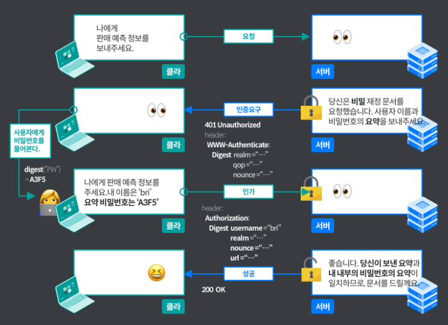

## HTTP에서 사용하는 인증 방법

HTTP/1.1에서 이용할 수 있는 인증 방식은 다음과 같다.

1. BASIC 인증
2. DIGEST 인증
3. SSL 클라이언트 인증
4. 폼 베이스 인증

### 1. BASIC 인증

1. 클라이언트에서 리퀘스트 송신
2. 서버에서 401로 응답하여 인증이 필요하다는 것을 전달
3. 유저ID, PW를 송신한다. 이 때 브라우저가 알아서 base64형식으로 전달한다.
4. 인증이 정확하면 요청한 리소스를 반환한다.

> base64 형식은 암호화가 아니라서 아무런 부가정보 없이 복호화가 가능해 도청당할 가능성이 있다. 그리고, 한번 인증하고 나서 로그아웃을 할 수 없다. 이런 사용상 문제, 보안등급이 낮다는 점에서 사용되고 있지 않다.

 

### 2. DIGEST 인증

BASIC인증 약점을 보완해 나왔다. 챌린지 리스폰스 방식이 사용되고 있어 패스워드를 그대로 보내지 않는다.

> **챌린지 리스폰스 방식**  
> 한쪽에서 질문을 던지면 다른 한쪽에서 적절한 대답을 응답하게 함으로써 인증하는 방식.  

인증 수순은 다음과 같다.

1. 서버가 클라이언트에게 인증요구를 할 때 realm과 nonce는 반드시 포함되어야 한다. nonce는 401리스폰스를 반환할 때마다 무조건 생성되는 유일한 문자열이다. 서버에 의존한다. 
2. 클라이언트가 서버에 인가를 요청할 때 authorization메시지에 digest를 담아 서버에게 돌려준다. 이 때 username, realm, nonce, uri, response는 반드시 포함해야 한다. realm하고 nonce는 서버에서 받은 것을 사용한다. username은 realm에서 인증 가능한 사용자 이름이다. response는 패스워드 문자열을 MD5로 계산한 것으로, 이것이 리스폰스 코드다.
3. 정확하면 리소스를 포함해서 반환한다.

DIGEST 인증은 BASIC 인증에 비해 높은 보안등급이지만 HTTPS의 클라이언트 인증에 비해 낮고, 패스워드 도청을 방지하기 위한 보호 기능은 제공하지만 이외에 위장을 방지하는 기능은 제공하지 않다. 그래서 사용상 문제, 보안상 요구되는 등급에 맞지 않아 그다지 사용되지 않는다.

 

### 3. SSL 클라이언트 인증

아이디, 패스워드만 있으면 본인인증이 가능한데, 이 정보가 도난당했다면 제3자가 위장을 할 수 있다. 이를 방지하기 위해 SSL 클라이언트 인증이 사용되는 일이 있다. HTTPS의 클라이언트 인증서를 이용한 인증 방식인데 사전에 등록된 클라이언트의 액세스인지를 확인할 수 있다.

SSL 클라이언트 인증을 할 때는 사전에 클라이언트에 클라이언트 증명서를 배포하고, 인스톨 해 둘 필요가 있다.

수순은 다음과 같다.

1. 리퀘스트
2. Certificate Request라는 메시지 송신
3. 유저는 송신할 클라이언트 증명서를 선택한다. 그리고 Client Certificate라는 메시지를 송신한다.
4. 클라이언트 증명서를 검증해 정확하다면 클라이언트의 공개키를 취득한다.

 

### 4. SSL 클라이언트 인증은 2-factor 인증에서 사용된다.

폼 베이스 인증과 합쳐 대부분 사용된다. 즉, 첫번째로 클라이언트 인증으로 컴퓨터를 인증하고, 패스워드를 사용해서 유저인지 확인한다. SSL클라이언트 인증은 인증기관에서 구입하는 비용이나 자체적으로 만든다면 안전하게 운용할 비용이 들어간다.

 

## 폼 베이스 인증

앞서 말한 것들은 사용상 문제, 보안등급, 비용상 문제로 사용하지 않는다. 웹 사이트마다 다르게 구현되어 있는 폼 베이스 인증 방법은 iD, 패스워드가 기존에 등록한 것과 일치하는지 검증하면서 이루어진다. HTTP의 스테이트리스 특성을 방지하고 세션을 유지하기 위해 쿠키를 사용하기도 한다.

1. 클라이언트는 아이디, 패스워드를 쳐서 POST메소드로 엔티티바디에 자격정보를 담아 HTTPS통신을 한다.
2. 서버 측은 유저를 식별하기 위해 세션ID를 발행한다. 인증상태를 서버측에 기록한다. 세션ID는 추측하기 어려운 문자열을 사용하고 유효기간을 관리한다. 크로스 사이트 스크립팅을 방지하기 위해 쿠키에 httponly속성을 부여하기도 한다.
3. 클라이언트는 다음에 서버에 접속하여 리퀘스트를 송신할 때 브라우저가 자동으로 쿠키를 송출하여 세션ID가 서버에 송신된다.

서버측에서 보관할 때는 표준화되어 있지는 않지만 salt라는 부가정보 사용해서 해시 알고리즘으로 계산한 값을 저장한다.

# 참고

https://feel5ny.github.io/2019/11/24/HTTP_013_01/