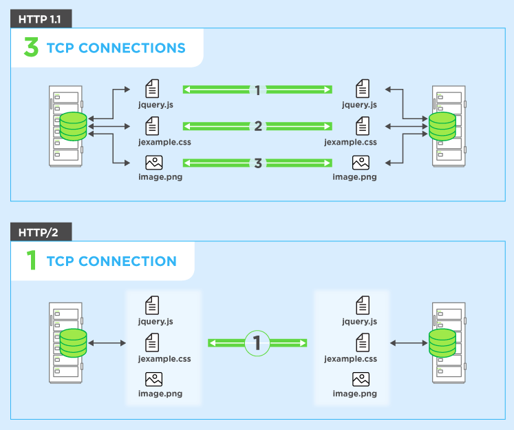

# 9장 : HTTP에 기능을 추가한 프로토콜

HTTP 규격이 만들어졌을 무렵 HTML로 작성된 문서를 전송하기 위한 프로토콜이었다. 시간이 지나 웹의 용도는 쇼핑 사이트, SNS, 기업이나 조직에서 사용하는 사이트들도 나왔다. HTTP의 한계가 있어서 새로운 프로토콜을 만들 수도 있으나, 이미 많은 곳에서 HTTP를 사용하고 있어서 어렵다. 그래서 HTTP를 기반으로 새로운 형태의 프로토콜이 나오게 된다.

## SPDY

HTTP2.0이 출시되면서 SPDY 개발은 중단되었지만, SPDY규격을 참고하여 개발되었다. SPDY는 웹 콘텐츠를 전송할 목적으로 개발된 네트워크 프로토콜이다. 웹 페이지 부하 레이턴시를 줄이고, 웹 보안을 개선하는 목표로 한다. 압축, 다중화, 우선순위 설정을 통한 레이턴시 감소를 목적으로 했다. 하나의 소켓 연결을 통해 여러 하위요소를 한번에 전송받을 수 있도록 개발되었으며, SPDY헤더는 압축되어 적은 용량을 차지한다. SPDY서버는 클라이언트 요청을 기다리지 않고 내용이 변경되었음을 클라이언트에게 알리거나, 변경내용을 직접 전송할 수도 있다. 암호화되지 않은 연결을 지원하지 않으며, SSL 또는 TLS로 암호화되어야 한다. HTTP를 대체하는 프로토콜이 아니다. 전송 계층 구현만 변경하면 기존 HTTP서버 그대로에서 SPDY를 사용할 수 있다. 기존에 보냈던 HTTP헤더와 같은 내용 헤더가 재전송 될 경우, 내용이 다른 부분만 압축하여 보내 전송 시간을 절약한다. 

 

## Ajax

이미 있던 기술이다가 2004년, 2005년에 구글이 Gmail, Google Maps에 ajax를 채택하기 시작하면서 널리 알려지기 시작했다. 웹 페이지 일부분만 고쳐쓸 수 있는 비동기 통신 방법이다. 페이지 일부만 변경하면서 전송되거나 웹 서버에서 처리해야하는 데이터량이 줄어들었다.

 

## Comet

클라이언트가 HTTP 요청을 하지 않으면서 데이터를 브라우저에 푸쉬할 수 있게 해주는 웹 어플리케이션 모델이다. 이런 상호작용을 하기 위한 여러 기법을 두루 아우르는 포괄적인 용어다. 단점으로 커넥션이 유지되어야 한다는 점이 있어 HTTP를 대체할 수 없다.

 

## WebSocket

Ajax와 Comet을 사용해서 브라우저 속도를 올릴 수 있었지만, HTTP의 한계로 인해 병목 현상을 해결할 수는 없었다. Websocket은 새 프로토콜과 API로 이 문제를 해결하기 위한 기술로 개발되었다. 초반에는 HTML5의 일부로 책정되었지만, 지금은 단독 프로토콜로 규격 책정이 진행되었다.  WebSocket프로토콜을 IETF가 책정하고, WebSocket API를 W3C가 책정한다. Ajax나 Comet에서 사용하는 XMLHttpRequest의 결점을 해결하기 위한 기술로 발전되어왔다.  

WebSocket은 클라이언트와 서버가 한번 접속을 확립하면, 그 뒤는 모두 전용 프로토콜로 통신한다. HTTP에 의한 접속 출발점이 클라이언트인 점은 동일하지만, 한 번 접속을 확립하면 서버나 클라이언트 어느 쪽에서도 먼저 송신을 할 수 있다. 주요 특징은 다음과 같다.

- **서버 푸시 기능**  
  클라이언트 요청을 기다리지 않고 데이터를 보낸다.
- **통신량 감소**  
  한번 접속하면 접속을 유지하려고 하는데, HTTP에 비해 자주 접속을 하는 오버헤드가 적어지고, 헤더의 사이즈도 작아서 통신량을 줄일 수 있다. WebSocket으로 통신하기 위해서는 한번 HTTP로 접속을 확립하고, 핸드쉐이크 절차를 발아야 한다.
- **핸드 쉐이크/리퀘스트**  
  WebSocket으로 통신을 하려면 HTTP의 Upgrade 헤더 필드를 사용해서 프로토콜을 변경하는 것으로 핸드쉐이크를 실시한다. Sec-WebSocket-Key에는 핸드쉐이크에 필요한 키가 저장되어 있고, Sec-WebSocket-protocol에는 사용하는 서브 프로토콜이 저장되어 있다.
- **핸드 쉐이크/리스폰스**  
  상태코드 101 Switching Protocols로 반환한다. WebSocket 커넥션이 확립된 후에는 HTTP가 아닌, WebSocket 독자적으로 통신한다.
- **WebSocket API**  
  Javascript에서 WebSocket 프로토콜을 사용해서 양방향 통신을 하기 위해서는 WebSocket API를 사용해야 한다.

 

## HTTP/2.0

HTTP/1의 확장으로 기존HTTP/1과 호환성을 유지하며, 성능에 초점을 맞춘 프로토콜이다. 

- 하나의 TCP연결로 데이터를 병렬로 보낼 수 있다.

 

- 여러번 요청할 때 중복으로 헤더를 보내지 않는다. 모바일의 경우 대역폭이 상대적으로 작아 유리하다. 그리고 점점 더 커지는 추세라서 무시할 수 없는 영향력이다. 헤더를 압축해서 보내는 것도 포함이다.

  

 

- **텍스트 프로토콜에서 바이너리 프로토콜로 변경**  

  HTTP/2를 사용하면 텍스트 명령을 바이너리로 변환한다. 바이너리 프로토콜로 전환하면 얻는 이점은 다음과 같다.

  - 데이터 파싱이 더 빠르고, 오류 발생 가능성이 낮다.
  - 네트워크 리소스를 효과적으로 사용한다.
  - 텍스트 특성과 관련된 보안 문제를 해결할 수 있다.(Response Splitting Attacks)
  - HTTP/2 다른 기능을 활성화할 수 있다.

- **리소스 간 의존 관계에 따른 우선순위 설정 가능**

- **클라이언트 요청을 기다리지 않고 응답할 수 있다.**

 

## WebDAV

Web Distributed Authoring and Versioning의 약자로 HTTP의 확장으로 서버의 문서, 파일을 편집하는 것을 손쉽게 만들어준다.

- Collection: 여러 리소스를 한꺼번에 관리하기 위한 개념.
- 프로퍼티: 리소스 프로퍼티를 정의.
- 잠금: 파일을 편집할 수 없는 상태로 함. 여러 명이 동시에 편집하는 경우 등 동시에 작업하는 걸 방지.

 

## HTTP를 이렇게까지 사용하는 이유

많은 이유 중 하나는 기업이나 조직 등 방화벽 설정과 관련이 있다. 지정된 프로토콜 이외 패킷은 통과시키지 않는 기능이 있어서 새로운 프로토콜, 포트를 도입하기는 추가 설정을 해야 한다. 이미 HTTP는 허가가 되어있는 경우가 많아 방화벽에 추가적인 설정을 할 필요가 없다.