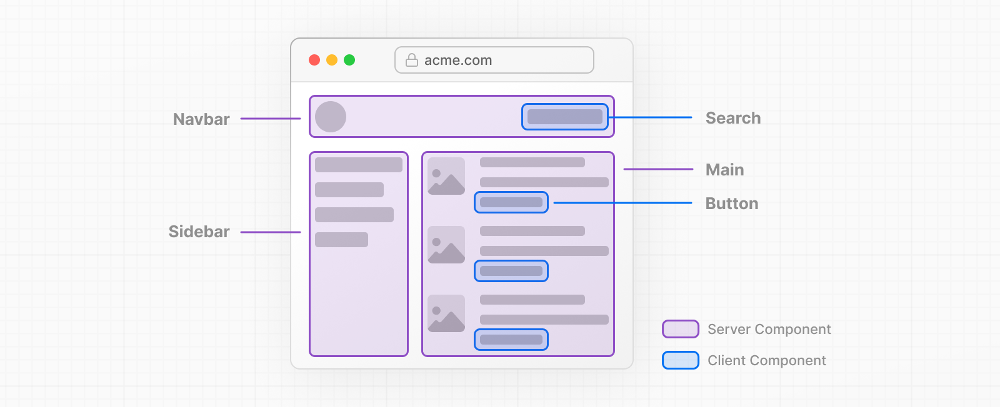
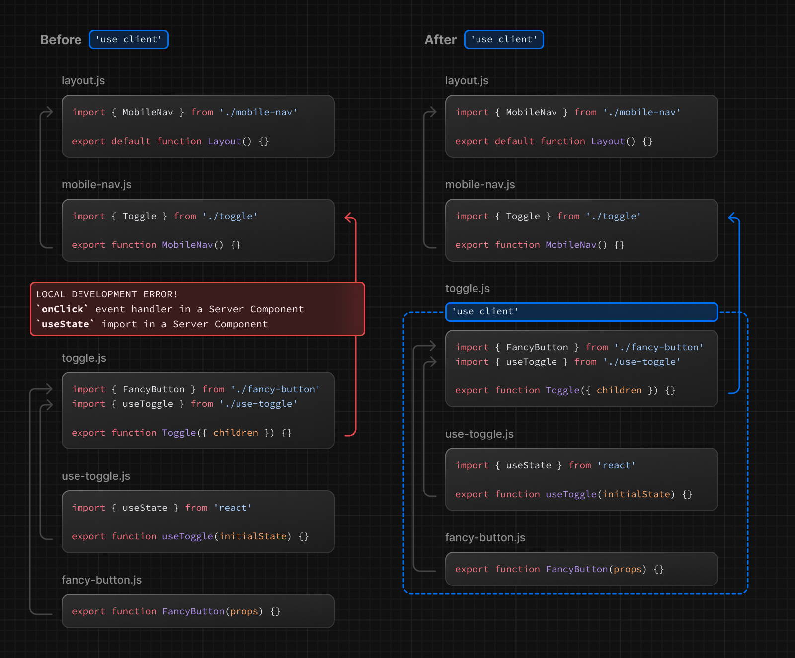

# 리액트 에센셜

## Sever Components

### Thinking in Server Components

React Server Components는 목적에 따라 유연하게 렌더링할 위치를 클라이언트 or 서버로 선택할 수 있다.



페이지를 작은 컴포넌트로 분할할 경우, 대부분 컴포넌트는 상호작용이 불필요한 컴포넌트고 서버에서 렌더링될 수 있다. 작은 상호작용 UI의 경우 클라이언트 컴포넌트에서 뿌릴 수 있다. 이는 Next.js의 서버 우선 접근 방식과 일치한다.

### Why Server Components? (서버 컴포넌트를 선택해야 하는 이유)

초기 HTML을 서버에서 렌더링하고 클라이언트 측에서 런타임을 비동기적으로 로드해서 점진적으로 향상시키고 상호 작용을 추가할 수 있다.

- 데이터를 가져오는 행위를 DB와 가깝게 서버로 이동할 수 있다.

- 서버에서 필요한 모듈을 import해서 사용할 수 있게 되어 클라이언트 JS 번들 크기를 줄일 수 있다. 성능 향상도 기대할 수 있다.

- 초기 페이지 로드 속도가 빨라진다.

- 추가적인 JS는 상호작용이 사용되는 경우에만 추가된다.


## Client Components

클라이언트 측 상호작용을 추가할 수 있다. 서버에서 미리 렌더링되고 클라이언트에서 hydrate된다.

### The "use client" directive

The `"use client"` directive는 서버 컴포넌트와 클라이언트 컴포넌트의 경계를 정의하는 컨벤션이다.



`"use client"`는 서버 전용 코드와 클라이언트 코드 사이에 위치한다. 서버에서 클라이언트 부분까지 경계를 정의하기 위해 import하는 파일 가장 위에 배치한다. 한번만 `"use client"`를 선언하면 하위 다른 모듈들은 클라이언트 번들 일부가 된다.

<br />

## When to use Server and Client Components?

서버 컴포넌트와 클라이언트 컴포넌트 간의 결정을 간소화하기 위해 클라이언트 컴포넌트에 대한 사용 사례가 있을 때까지 서버 컴포넌트(앱 디렉토리의 기본값)를 사용하는 것이 좋다.

| What do you need to do?                                      | Server Component | Client Component |
| ------------------------------------------------------------ | ---------------- | ---------------- |
| Fetch data.                                                  | O                | X                |
| Access backend resources (directly)                          | O                | X                |
| Keep sensitive information on the server (access tokens, API keys, etc) | O                | X                |
| Keep large dependencies on the server / Reduce client-side JavaScript | O                | X                |
| Add interactivity and event listeners (`onClick()`, `onChange()`, etc) | X                | O                |
| Use State and Lifecycle Effects (`useState()`, `useReducer()`, `useEffect()`, etc) | X                | O                |
| Use browser-only APIs                                        | X                | O                |
| Use custom hooks that depend on state, effects, or browser-only APIs | X                | O                |
| Use [React Class components](https://react.dev/reference/react/Component) | X                | O                |

<br />

## Pattern

### leaf로 클라이언트 컴포넌트를 이동

성능을 향상시키기 위해 클라이언트 컴포넌트를 가능하면 leaf로 이동시키는 것이 좋다. 예를 들어 정적요소와 함께 있는 검색바를 생각해보자. 전체 레이아웃을 Client 컴포넌트로 만드는 것보다 서버 컴포넌트를 유지하면서 인터렉티브한 컴포넌트를 뺀다.

`app/layout.tsx`

```tsx
// SearchBar is a Client Component
import SearchBar from './searchbar';
// Logo is a Server Component
import Logo from './logo';
 
// Layout is a Server Component by default
export default function Layout({
  children,
}: {
  children: React.ReactNode;
}) {
  return (
    <>
      <nav>
        <Logo />
        <SearchBar />
      </nav>
      <main>{children}</main>
    </>
  );
}
```

<br />

### 클라이언트 및 서버 컴포넌트 구성

서버 및 클라이언트 컴포넌트는 동일한 트리에서 결합할 수 있다. 백그라운드에서 React는 다음과 같이 렌더링 처리한다.

- 클라이언트로 보내기 전 서버 컴포넌트를 렌더링한다. 이 단계에서 클라이언트 컴포넌트는 건너뛴다.
- 클라이언트에서 React는 서버 컴포넌트의 렌더링된 결과에다가 컴포넌트 및 slot을 렌더링해서 병합한다.
  - 만약, 서버 컴포넌트가 클라이언트 컴포넌트 내에 중첩되어 있다면 클라이언트 컴포넌트 내에 옳바르게 배치된다.

<br />

### 클라이언트 컴포넌트 내부에 서버 컴포넌트 중첩

렌더링 흐름을 고려할 때, 서버 컴포넌트를 클라이언트 컴포넌트로 가져오는 데는 추가 서버 왕복이 필요하므로 제한이 있다.

#### 지원되지 않는 패턴 : 클라이언트 컴포넌트로 서버 컴포넌트 가져오기

아래 예제처럼 이 패턴은 지원되지 않는다. 서버 컴포넌트를 클라이언트 컴포넌트로 가져올 수 없다.

`app/example-client-component.tsx`

````tsx
'use client';
 
// This pattern will **not** work!
// You cannot import a Server Component into a Client Component.
import ExampleServerComponent from './example-server-component';
 
export default function ExampleClientComponent({
  children,
}: {
  children: React.ReactNode;
}) {
  const [count, setCount] = useState(0);
 
  return (
    <>
      <button onClick={() => setCount(count + 1)}>{count}</button>
 
      <ExampleServerComponent />
    </>
  );
}
````

#### 권장패턴 : 서버 컴포넌트를 클라이언트 컴포넌트에 props로 전달

대신에, 클라이언트 컴포넌트에 서버 컴포넌트를 위해 props를 사용할 수 있다.

서버 컴포넌트는 서버에서 렌더링되고, 클라이언트 컴포넌트가 클라이언트에서 렌더링될 때 hole에 서버 컴포넌트의 렌더링된 결과가 채워진다.

일반적인 패턴은 hole을 만들기 위해 `children` prop을 사용하는 것이다. 위 ExampleClientComponent를 리팩터링해보자.

`app/example-client-component.tsx`

```tsx
'use client';
 
import { useState } from 'react';
 
export default function ExampleClientComponent({
  children,
}: {
  children: React.ReactNode;
}) {
  const [count, setCount] = useState(0);
 
  return (
    <>
      <button onClick={() => setCount(count + 1)}>{count}</button>
 
      {children}
    </>
  );
}
```

지금은, ExampleClientComponent에서 children이 무엇인지 알지 못한다. 상위 서버 컴포넌트에서는 ExampleClientComponent와 ExampleServerComponent 다 가져올 수 있고, ExampleClientComponent 자식으로 ExampleServerComponent를 가져오는 식이 된다.

`app/page.tsx`

```tsx
// This pattern works:
// You can pass a Server Component as a child or prop of a
// Client Component.
import ExampleClientComponent from './example-client-component';
import ExampleServerComponent from './example-server-component';
 
// Pages in Next.js are Server Components by default
export default function Page() {
  return (
    <ExampleClientComponent>
      <ExampleServerComponent />
    </ExampleClientComponent>
  );
}
```

이런 접근방식으로, ExampleClientComponent와 ExampleServerComponent 렌더링이 분리되고 클라이언트 컴포넌트보다 먼저, 서버에서 독립적으로 서버 컴포넌트는 렌더링 될 수 있다.

> **Good To Know**  
>
> - 이 패턴은 이미 `children` prop과 함께 **<u>레이아웃 및 페이지</u>**에 적용되어있다. 그래서 추가적인 wrapper 컴포넌트를 만들필요가 없다.
> - 컴포넌트를 다른 컴포넌트에게 전달하는 것은 새로운 개념이 아니라 이미 React Composition Model의 일부로 있었다.

<br />

### 서버에서 클라이언트 컴포넌트로 props 전달(직렬화)

서버에서 클라이언트 컴포넌트로 전달되는 속성은 직렬화되어야 한다. 즉, 함수, 날짜 등 값을 직접 클라이언트 컴포넌트에 전달할 수 없다.

> **Where is the Network Boundary?**  
>
> 앱 라우터에서 Network Boundary는 서버 컴포넌트와 클라이언트 컴포넌트 사이에 있다. 이것은 getStaticProps/getServerSideProps와 페이지 컴포넌트 사이 경계와 다르다. 서버 컴포넌트 내부에서 가져온 데이터는 클라이언트 컴포넌트로 전달되지 않는 한 Network boundary를 통과하지 않기 때문에 직렬화할 필요가 없다. (즉, 이전에 page에서 getStaticProps와 같은 함수를 사용할 때는 서버 컴포넌트 내부에서 가져왔기 때문에 직렬화할 필요가 없었다.) [데이터 가져오기](https://nextjs.org/docs/app/building-your-application/data-fetching#fetching-data-on-the-server)에 대해 자세히 읽어볼 수 있다.

<br />

### 서버 전용 코드를 클라이언트 컴포넌트에서 제외

Javascript 모듈은 서버 및 클라이언트 컴포넌트 간에 공유될 수 있으므로 서버에서만 실행되도록 의도된 코드가 클라이언트로 몰래 유입될 수 있다. 예를 들어서, 다음과 같은 data fetch를 사용하는 경우를 보자.

`lib/data.ts`

```ts
export async function getData() {
  const res = await fetch('https://...', {
    headers: {
      authorization: process.env.API_key,
    }
  })
  
  return res.json();
}
```

언뜻 보기에는 getData() 함수가 클라이언트, 서버 모두에서 동작할 것처럼 보인다. 하지만, 환경변수를 보면 `API_KEY`앞에 접두사로 `NEXT_PUBLIC`이 붙지 않았기 때문에 서버에서만 액세스할 수 있는 private 변수다. (Next.js는 private 환경 변수를 클라이언트 코드에서 빈 문자열로 대체해서 보안 정보가 유출되지 않게 한다.)  

결과적으로, getData()를 클라이언트에서 실행할 수는 있지만 제대로 동작하지 않는다. 만약, 변수를 공개하면 동작은 하겠지만 중요한 정보가 유출될 위험이 있다. 그래서 서버용으로만 동작해야 한다.

<br />

### The "server only" package (서버 전용 패키지)

이런 서버 코드들을 클라이언트에서 사용하는 것을 방지하기 위해, `server-only` 패키지를 사용할 수 있다. `server-only` 패키지는 클라이언트에서 사용할 경우 빌드 오류를 제공하는 패키지다.

1. `server-only`패키지를 설치한다.

   ```bash
   npm install server-only
   ```

2. 패키지를 import한다.

   `lib/data.js`

   ```js
   import 'server-only';
   
   export async function getData() {
     const res = await fetch('https://...', {
       headers: {
         authorization: process.env.API_key,
       }
     })
     
     return res.json();
   }
   ```

   마찬가지로 `client-only` 도 사용할 수 있다. 예를 들어서, window 객체를 사용하는 코드의 경우에 사용할 수 있다.

   <br />


### 데이터 가져오기

클라이언트 컴포넌트에서 데이터를 가져올 수 있지만, 특별한 이유가 없는한 서버 컴포넌트에서 데이터를 가져오는 것이 좋다. Data fetch를 서버에서 하면 성능, UX가 개선된다.

<br />

### Third-party 패키지

서버 컴포넌트는 새로운 것이기 때문에 타사 패키지가 이제 막 추가되기 시작했다. 따라서, 클라이언트 컴포넌트에서 동작하는 이런 라이브러리들은 `'use client' `사용을 명시하고 있지 않다. 클라이언트 컴포넌트를 별도로 만들고 거기서 import한 뒤 서버 컴포넌트에서 해당 클라이언트 컴포넌트를 import해서 사용하면 된다.  

`app/carousel.tsx`

```tsx
'use client';

import { Carousel } from 'acme-carousel';

export default Carousel;
```

이제 ServerComponent내에서 `<Carousel />`을 사용하면된다.

`app/page.tsx`

```tsx
import Carousel from './carousel';

export default function Page() {
  return (
    <div>
      <p>View pictures</p>
      
      {/* Works, since Carousel is a Client Component */}
      <Carousel />
    </div>
  )
}
```


한 가지 예외케이스가 있는데 Provider 컴포넌트일 때다. React state나 context에 의존하며 때로는 root에서 필요하기 때문이다. 더 알아보고 싶다면 [third-party context providers below](https://nextjs.org/docs/getting-started/react-essentials#rendering-third-party-context-providers-in-server-components)를 참고하자.

#### Library Authors

- 비슷한 방식으로 라이브러리 제작자가 그들의 패키지에 "use client" 지시를 사용할 수 있다. 이 경우 Consumer는 위와같이 wrapper 컴포넌트를 만들지 않고 가져와서 그대로 사용하면 된다.
- `'use client'`를 트리에서 더 깊은 곳에서 사용하고 서버컴포넌트의 일부로 module을 import한다면 더 최적화 할 수 있다.

<br />

---

## Context

대부분 리액트 어플리케이션은 createContext를 통해 직접 또는 third-party 라이브러리에서 가져온 Provider Component 요소를 통해서 컴포넌트간 데이터를 공유하기 위해 Context에 의존한다.  

넥스트 13의 경우, 클라이언트 컴포넌트 내에서 context를 지원한다. 하지만 서버 컴포넌트 내에서 직접적으로 생성하거나 사용할 수 없다. 이유는 Server Components는 React의 State를 가지고 있지 않기 때문이다.(상호작용 하지 않는 것이 그 이유다.) 그리고 context는 주로 일부 React 상태가 업데이트 된 후 트리에 있는 상호작용 컴포넌트를 렌더링하는데 사용된다.  

서버 컴포넌트 간 데이터 공유를 위한 대안을 설명하겠지만, 먼저 클라이언트 컴포넌트 내에서 컨텍스트를 사용하는 방법에 대해 살펴보자.

###  Using context in Client Components (클라이언트 컴포넌트에서 context 사용하기)

모든 ContextAPI는 클라이언트 컴포넌트에서 완벽하게 지원된다.

`app/sidebar.tsx`

```tsx
'use client';

import { createContext, useContext, useState } from 'react';

const SidebarContext = createContext();

export function Sidebar() {
  const [isOpen, setIsOpen] = useState(false);
  
  return (
    <SidebarContext.Provider value={{isOpen}}>
      <SidebarNav />
    </SidebarContext.Provider>
  );
}

function SidebarNav() {
  let { isOpen } = useContext(SidebarContext);
  
  return (
    <div>
      <p>Home</p>
      
      {isOpen && <SubNav />}
    </div>
  )
}
```

하지만, ContextProvider는 일반적으로 글로벌 관심사와 공유하기 위해서 루트 근처에서 렌더링된다. 왜냐하면 context는 ServerComponents를 지원하지 않기 떄문이다. 루트에 컨텍스트를 생성하려고 하면 다음 에러가 발생한다.

`app/layout.tsx`

```tsx
import { createContext } from 'react';
 
//  createContext is not supported in Server Components
export const ThemeContext = createContext({});
 
export default function RootLayout({ children }) {
  return (
    <html>
      <body>
        <ThemeContext.Provider value="dark">{children}</ThemeContext.Provider>
      </body>
    </html>
  );
}
```

이것을 고치기 위해 클라이언트 컴포넌트 내부에 context를 만든다.

`app/theme-provider.tsx`

```tsx
'use client';

import { createContext } from 'react';

export const ThemeContext = createContext({});

export default function ThemeProvider({children}) {
  return (
    <ThemeContext.Provider value="dark">
    	{children}
    </ThemeContext.Provider>
  )
}
```

Server Component에서 이제 렌더링할 수 있다.

`app/layout.tsx`

```tsx
import ThemeProvider from './theme-provider.tsx';

export default function RootLayout({
  children
}: {
  children: React.ReactNode;
}) {
  return (
    <html>
      <body>
        <ThemeProvider>{children}</ThemeProvider>
      </body>
    </html>
  )
}
```

Provder와 함께 루트에서 렌더 되어서 서버컴포넌트에서 Provider를 import할 수 있고 모든 클라이언트 컴포넌트는 context를 사용할 수 있어졌다.

<br />

### Rendering third-party context providers in Server Components

Third-party들이 아직은 'use client'지시자가 추가되어있지 않은 것이 있다. 그래서 이럴 때 위와방식처럼 provider 컴포넌트를 만들고 내부에서 'use client'를 쓰고 children을 third-party Provider로 감싸자.  

그러면 이제 ServerComponents에서 Provider를 import해서 사용할 수 있다.

<br />

### Sharing data between Server Components

서버 컴포넌트는 상호작용하지 않기 때문에 React State를 읽을 필요 없다. 그래서 이런 data를 공유하기 위해 React context를 사용할 필요가 없다.  대신 여러 서버 컴포넌트가 액세스해야 하는 공통 데이터에 대해 native JS 패턴을 사용할 수 있다.

`utils/database.ts`

```ts
export const db = new DatabaseConnection();
```

`app/users/layout.tsx`

```tsx
import { db } from '@utils/database';

export async function UsersLayout() {
  let users = await db.query();
}
```

`app/users/[id]/page.tsx`

```tsx
import { db } from '@utils/database';

export async function DashboardPage() {
  let user = await db.query();
  // ...
}
```

위 예제에서 layout과 page 둘다 database query를 만들어야 한다. 이런 각 구성요소는 `@utils/database`모듈을 가져와 데이터베이스에 대한 엑세스 권한을 공유한다. 이 JS패턴을 **global 싱글톤**이라고 부른다.

<br />

### Sharing fetch requests between Server Components (서버 컴포넌트 간에 데이터 공유하는 것)

데이터를 요청할 때, 너는  fetch 결과를 page나 layout 그리고 children 컴포넌트들에게 공유하기를 원할 수 있다. 이는 불필요한 커플링이며 컴포넌트 간에 props가 앞뒤로 전달될 수 있다.  

대신 데이터를 소비하는 컴포넌트 옆에 데이터 패칭하는 것을 모으는 것을 추천한다. fetch요청은 서버 컴포넌트에서 자동으로 중복 제거되기 때문에 각 경로 세그먼트는 중복 요청에 대한 걱정 없이 데이터를 정확하게 요청할 수 있다. Next.js는 `fetch` 캐시로부터 같은 값을 읽는다.


> **원문**  
> [React 에센셜 원문](https://nextjs.org/docs/getting-started/react-essentials)

<br />