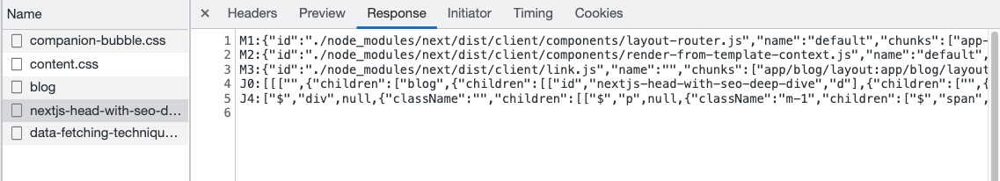

> Next.js에서 React Server Component와 Client Server에 대해 알아본다.
> https://kulkarniankita.com/react/react-server-client-components

Next.js에서 app 디렉토리에서 기본적으로 모든 컴포넌트들은 서버 컴포넌트다. 리액트 서버 컴포넌트와 클라이언트 컴포넌트에 대해 깊게 알아보자.

<br />

## React Server Component란 무엇일까?

리액트 서버 컴포넌트들은 서버에서 렌더링되고 요청되는 컴포넌트들이다. 만약, 클라이언트 쪽 번들에서 찾는다면 존재하지 않을 것이다.

### 리액트 서버 컴포넌트들의 특징들

- 서버 컴포넌트들은 onClick 같은 상호작용성을 포함하지 않는다.
- fallback, 함수들은 props로 전달할 수 없다.
- 상호작용하지 않기 때문에 React State가 필요 없다.
- 서버 컴포넌트들은 리액트의 Life Cycle Hooks를 사용하지 않는다.
- 백엔드 부분이라고 생각하면 이해가 될 것이다.
- 데이터 베이스 or 파일 시스템 기반 작업, 상호 작용이나 수명 주기 훅스가 없는 모든 컴포넌트가 예시다.

기본적으로, Next.js 13에서 컴포넌트들은 서버사이드 컴포넌트들이다.

<br />

## 서버 컴포넌트들의 목적

서버 컴포넌트의 가장 중요한 장점 중 하나는 서버 컴포넌트들이 클라이언트 측 번들에 포함되지 않는다는 것이다. 이를 통해 클라이언트 측으로 작은 번들을 발송할 수 있으므로 사용자가 적은 JS코드들을 다운로드 하도록 한다. 이는 핸드폰 데이터 사용, 인터넷이 불안정한 곳에서 사용할 때 큰 도움을 준다. 


위 예시에서 Page, Card List는 서버 컴포넌트이고 Card, Date는 클라이언트 측 구성요소다. 일반적으로는 서버와 브라우저인 클라이언트가 있다. 브라우저가 JS를 받고 렌더링 한 뒤 API 데이터를 서버에 요청한다. 데이터가 수신되면 다시 렌더링한다.  

이 왕복은 불필요하다. 서버에서 데이터를 가져오고 렌더링을 수행할 수 있고, 브라우저에서는 서버에서 렌더링된 정적 페이지와 번들링된 JS파일을 서로 매칭시키면 될 것이다. 이것이 React Server Component가 탄생한 이유다.

<br />

## 클라이언트 사이드 컴포넌트들

클라이언트 사이드 컴포넌트들은 브라우저에서 요청하고 렌더링한 컴포넌트들이다.

### 리액트 클라이언트 컴포넌트 특징들

- onClick 핸들러 같은 상호작용이 포함된다.
- 클라이언트인 브라우저에서 렌더링된다.
- React 수명 주기 hooks를 사용할 계획인 경우 useState, useEffect같은 것들을 클라이언트 사이드에서 사용해야 한다.

<br />

## 서버 컴포넌트와 클라이언트 컴포넌트의 차이점

서버 컴포넌트는 서버에서 패칭하고 렌더링되지만, 클라이언트 컴포넌트는 브라우저에서 렌더되고 패칭한다. 라이프 사이클이나 상호작용을 포함하는 컴포넌트는 클라이언트 컴포넌트로 만들어라.

<br />

## 서버사이드 렌더링(SSR)과 서버 컴포넌트의 차이

- 서버사이드 렌더링
  - HTML을 미리 받아서 렌더링한다. SEO에 효과적이며, JS를 받는 동안 해당 페이지에서 컨텐츠를 볼 수 있다.
  - 페이지당, 해당 페이지 자체를 서버사이드 렌더링할 것인지 선택한다.

- 리액트 서버 컴포넌트
  - HTML을 반환하는 대신 렌더링된 UI를 반환한다. 이런 방식은, 리액트가 상태를 잃지 않고 해당 데이터를 기존 클라이언트 컴포넌트들과 영리하게 병합할 수 있다.
  - 각각의 컴포넌트마다 클라이언트 컴포넌트로 렌더링 할 것인지, 서버 컴포넌트로 렌더링 할 것인지를 선택하도록 한다.

아래 사진처럼 중간 state를 볼 수 있다. JSON이 아니지만, JSON과 비슷해 보인다. 이런 형태가 나오는 이유는 리액트 서버 컴포넌트들이 페이지에 컴포넌트들을 렌더하기 위해 다른 stream type을 사용하기 때문이다.



<br />

## 서버컴포넌트에서 Context 사용하기

"use client"를 사용해서 클라이언트 코드만 들어가는 컴포넌트를 만들고 그 안에서 context를 사용할 수 있다.

```js
//app/store-provider.js
'use client';
import { createContext, useReducer } from "react";

export const StoreContext = createContext();

const StoreProvider = ({ children }) => {
  const initialState = {
    data: []
  };
  return (
    <StoreContext.Provider value={{ state = initialState }}>
      {children}
    </StoreContext.Provider>
  );
};

//app/layout.js
export default function RootLayout({ children }) {
  return (
    <html>
      <body>
        <StoreProvider>
          {children}
        </<StoreProvider>>
      </body>
    </html>);
}
```

<br />

> 추가적으로 읽어보면 좋은 글들.
>
> -  https://tech.kakaopay.com/post/react-server-components/ : 전체적으로 더 자세한 설명으로 이해
> -  https://yceffort.kr/2022/01/how-react-server-components-work : 동작 방식에 대한 이해

