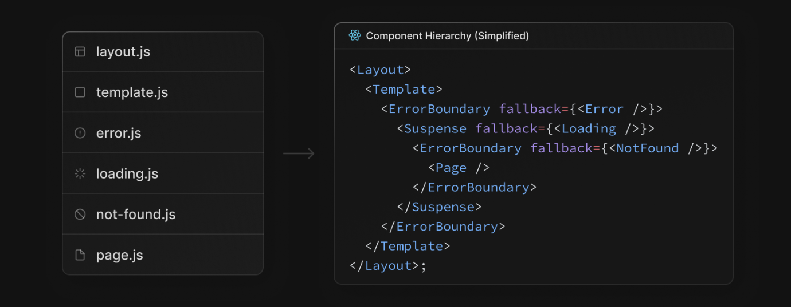
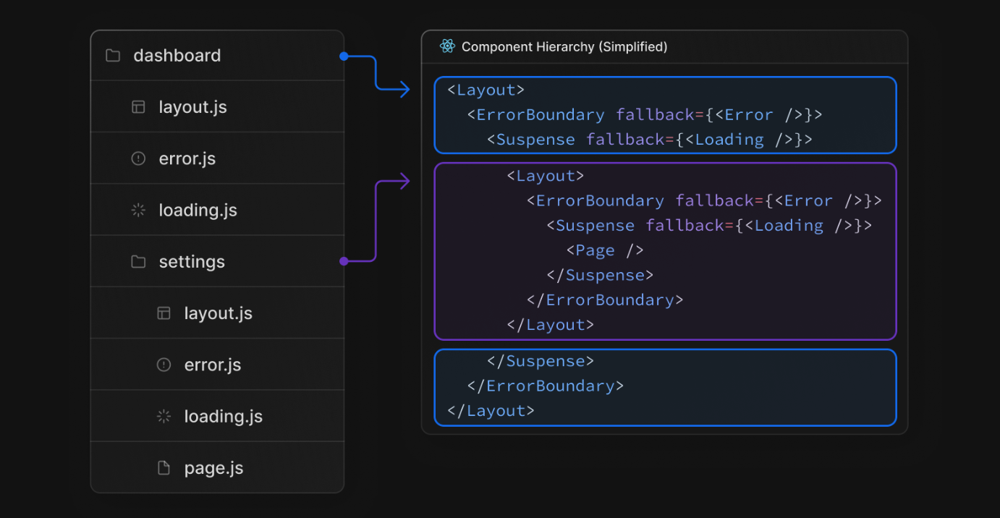

## 구조

---

### Top-level files

- `next.config.js` : Next.js를 위한 환경설정 파일
- [`middleware.ts`](https://nextjs.org/docs/app/building-your-application/routing/middleware) : Next.js 미들 웨어설정 파일
- `.env` : 환경 변수
- `.env.local` : 로컬 환경 변수
- `.env.production` : 프로덕션 환경 변수
- `.env.development` : 개발 환경 변수
- `.next-env.d.ts` : Next를 위한 Typescript 선언 파일

 

### Top-Level folders

- app : app router
- pages : pages router
- public : asset
- src : 선택적 응용 프로그램 원본 폴더

 

### 라우팅 파일

> js, jsx, tsx 다 가능하다.

- layout : 공유되는 UI. 각 라우팅 디렉토리에 존재할 수 있다. html과 body 태그를 사용한다.
- page : page
- loading.tsx : loading UI
- not-found.tsx : not found UI
- error : Error UI
- global-error : Global Error UI
- template : Re-renderd layout
- default : 병렬 Route Fallback 페이지

> js, ts만 가능하다.

- route : API endpoint

중첩이 가능하다.

 

### 동적 경로

- `[folder]` :  동적 경로 세그먼트
- `[...folder]` : 모든 세그먼트 캡처
- `[[...folder]]` : 모든 세그먼트(선택 사항) 캡처

 

### 라우팅 그룹 및 개인 폴더

- `(folder)` : 라우팅에 영향을 미치지 않고 경로 그룹화
- `_folder` : 폴더 및 모든 하위 세그먼트가 라우팅되지 않도록 선택

 

### 병렬 몇 인터셉트된 경로

