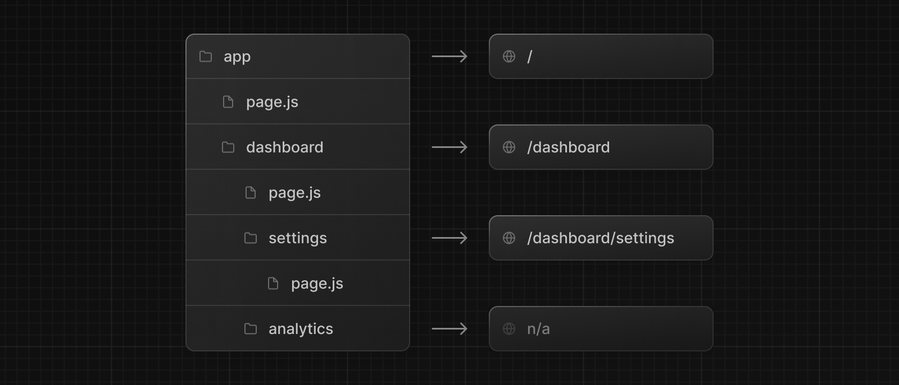

> Routing Fundamentals 페이지를 먼저 읽고오기를 추천한다.

이 페이지는 어떻게 정의하고 라우트를 구성해야 하는지 알려준다.

---

## Creating Routes

- Next.js는 폴더가 경로를 정의하는데 라우터 기반 파일시스템을 사용한다.  

- 각 폴더는 URL 세그먼트에 매핑되는 route segment를 나타낸다. 중첩 경로를 작성하려면 폴더를 서로 중첩해서 나타낼 수 있다.

- 경로 세그먼트를 공개적으로 액세스 할 수 있도록 특수 파일인 `page.js`를 사용한다.

- 아래 사진 예에서 `/dashboard/analytics` URL은 공개적으로 접근할 수 없다. `page.js`가 없기 때문이다. 이 폴더는 컴포넌트 저장소, 스타일시트, 이미지, 혹은 다른 파일을 포함할 수 있다.

  

