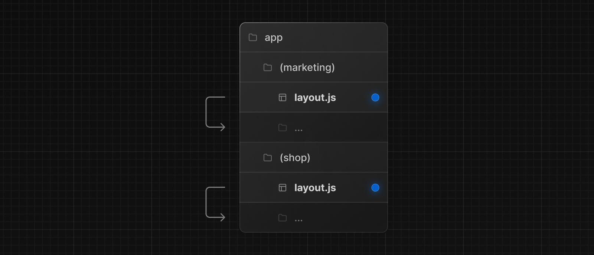

# Route Groups

`app` 디렉토리안에서 중첩된 폴더는 일반적으로 URL 경로에 매핑된다. 하지만, 폴더를 경로 그룹으로 표시해서 경로의 URL에 포함되지 않도록 할 수 있다.  

이렇게 하면 URL 경로 구조에 영향을 주지 않고도 경로와 프로젝트 파일을 구성할 수 있다.  

Route Groups이 유용할 때

- 사이트의 섹션, 목적 또는 팀에 따라서 구성
- 동일한 경로 세그먼트 수준에 중첩된 레이아웃 사용하기
  - 여러 루트 레이아웃을 포함하여 동일한 세그먼트에 여러 중첩된 레이아웃 작성(Route Group마다 root layout을 만들 수 있다.)
  - 공통 세그먼트의 경로 하위집합에 레이아웃 추가 (Route Group마다 root layout을 추가하고 하위에 공유하는 경로를 만들 수 있음.)

​	

---

## Convention

(folderName)으로 폴더를 만들어 감싸서 Route group를 구현한다.

---

## Examples

### URL 경로 영향없이 라우트 구성

소괄호 폴더는 경로에 영향을 미치지 않는다.

각 Route groups에 layout.js를 추가하여 각 그룹에 대한 레이아웃을 만들 수 있다.

### 레이아웃에 특정 세그먼트 선택

특정 경로들을 레이아웃으로 렌더링하려면 새 경로 그룹(ex. `(shop)`)을 만들고 동일한 레이아웃을 공유하는 경로(ex. `account`, `cart`)를 그룹으로 이동한다. 그룹 외부 경로는 레이아웃을 공유하지 않는다.(ex. `checkout`)

### 여러 root layout 만들기

top-level에 있는 layout.js 파일을 지우고 route group별 안에 layout.js를 만든다. 이 때 주의할 점은 각 root layout에 `<html>`>과 `<body>`태그를 각 루트 레이아웃에 추가해야 한다.

> **Good To Know**  
>
> - route groups의 이름 지정은 구성하는 것 외에 특별한 의미가 없다. URL경로에도 영향이 없다.
> - route groups 이름을 지을 때는 중복된 URL경로를 확인해야 된다. 예를 들어, (marketing)/about/page.js가 있고 (shop)/about/page.js가 있다면 오류를 발생시킨다.