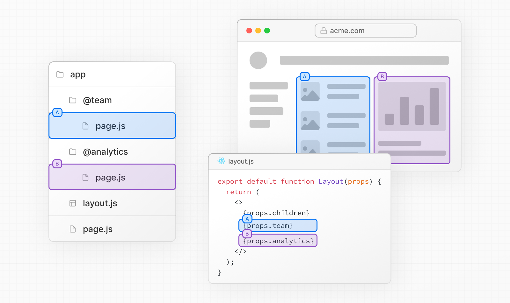
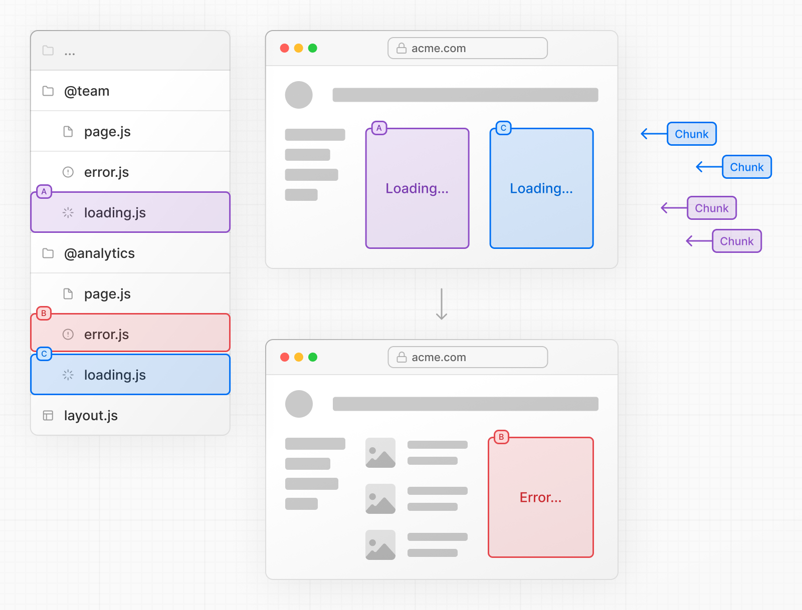
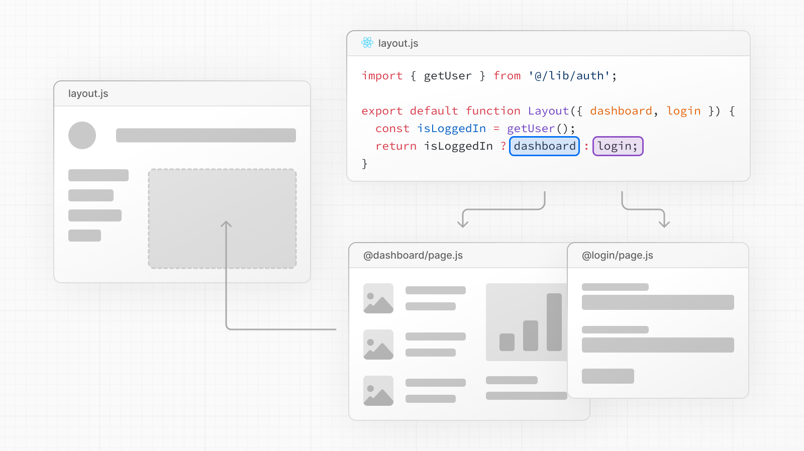
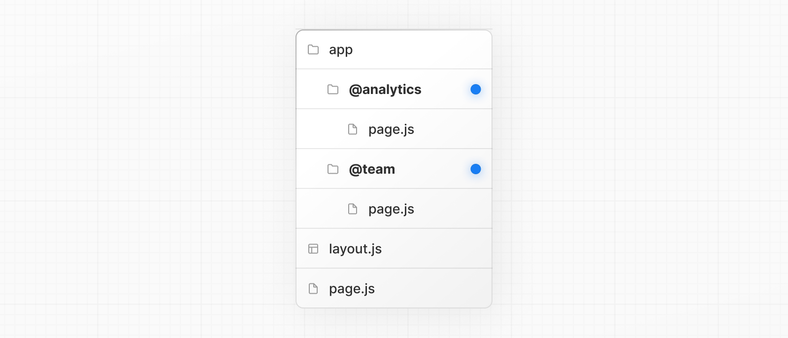
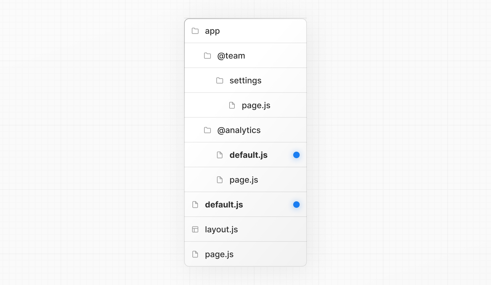
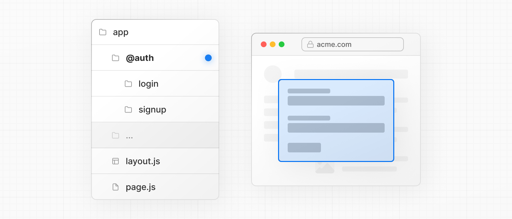
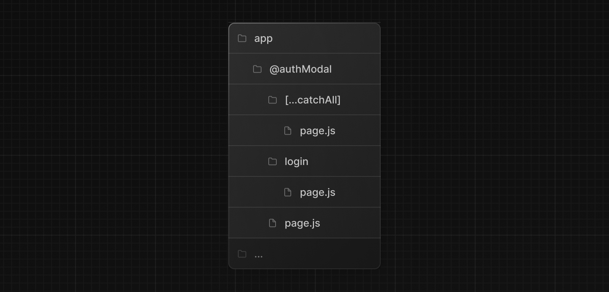

# Parallel Routes

병렬 라우팅을 사용하면 동일한 레이아웃에서 하나 이상의  `page.js`를 동시에 띄우거나 조건부로 렌더링 할 수 있다.  

소셜 사이트의 대시보드 및 피드와 같이 앱의 **매우 동적인 섹션의 경우에 병렬 라우팅을 사용해서 복잡한 라우팅 패턴을 구현할 수 있다.**  

예를 들어 아래 예제처럼 team 및 analytics 페이지를 동시에 렌더링 할 수 있다.



병렬 라우팅을 사용하면 **개별적으로** 스트리밍되는 각 경로에 대해 독립적인 `error` 및 `loading` 상태를 정의할 수 있다.



병렬 라우팅 사용 시 인증상태 같은 조건에 따라서 슬롯을 조건부로 렌더링 할 수 있다. 이렇게 하면 동일한 URL에서 완전히 구분된 코드를 사용할 수 있다.



---

## Convention

병렬 라우트는 `slots`이라고 명명된 것을 사용해서 만든다. 슬롯은 `@folder` 같이 정의한다. 그리고 같은 Level에 있는 layout에 props로 전달된다.

> Slots은 route 세그먼트가 아니므로 URL구조에 영향을 주지 않는다. `/@team/members` 파일 경로는 `/members`로 액세스 할 수 있다.

예를 들어, 다음 파일 구조는 두 개의 명시적 슬롯인 `@analytics`와 `@team`를 정의한다.



위 폴더 구조는 `app/layout.js`컴포넌트에서 `@analytics`와 `@team` Slot이 prop으로 오는 것을 받아드리고, 병렬로 렌더링할 수 있게된다.

`app/layout.tsx`

```tsx
export default function Layout(props: {
  children: React.ReactNode
  analytics: React.ReactNode
  team: React.ReactNode
}) {
  return (
    <>
      {props.children}
      {props.team}
      {props.analytics}
    </>
  )
}
```

> **Good to know**  
>
> `children`prop은 폴더에 매핑할 필요 없는 암묵적인 슬롯이다. 즉, `app/page.js`는 `app/@children/page.js`와 동일하다.

---

## Unmatched Routes

기본적으로, 슬롯 내에서 렌더링되는 content는 현재 URL과 일치한다.  

일치하지 않는 슬롯의 경우, Next.js가 렌더링하는 content는 라우팅 기법과 폴더 구조에 따라 다르다.

현재 URL을 기준으로 Next.js가 **슬롯의 active 상태를 복구할 수 없을 때** **fallback으로 렌더링할** `default.js`파일을 정의할 수 있다.  

다음 폴더 구조가 있다고 가정하자. `@team`슬롯은 `settings`디렉토리를 가지고 있다. 하지만, `@analytics`는 없다.



만약 `/`에서 `/settings`로 이동하는 경우 렌더링되는 content는 **탐색 유형**(Soft Navigation, Hard Navigation)과 `default.js`파일 가용성에 따라 달라진다.  

|                 | `@analytics/default.js`가 있는 경우                  | `@analytics/default.js`가 없는 경우               |
| --------------- | ---------------------------------------------------- | ------------------------------------------------- |
| Soft Navigation | `@team/settings/page.js` and `@analytics/page.js`    | `@team/settings/page.js` and `@analytics/page.js` |
| Hard Navigation | `@team/settings/page.js` and `@analytics/default.js` | 404                                               |

### Soft Navigation

[soft navigation](https://nextjs.org/docs/app/building-your-application/routing/linking-and-navigating#soft-navigation)시 Next.js는 현재 URL과 일치하지 않더라도 슬롯의 이전 상태를 렌더링한다.

### Hard Navigation(전체 페이지 다시 로드가 필요한 탐색)

[hard navigation](https://nextjs.org/docs/app/building-your-application/routing/linking-and-navigating#hard-navigation)시 Next.js는 먼저 일치하지 않는 슬롯의 `default.js` 파일을 렌더링 하려고 시도한다. 만약, `default.js`파일을 사용할 수 없는 경우 404가 렌더링된다. 

> 일치하지 않은 경로일 때 나타나는 404는 병렬 렌더링하지 않아야 되는 경로를 실수로 렌더링하지 않도록 하는데 도움이 된다.

> 병렬 라우팅 - Unmatched Routes의 예시는 공식문서를 보면서 가장 이해가 되지 않는 부분.

---

`useSelectedLayoutSegement(s)`

`useSelectedLayoutSegment`와 `useSelectedLayoutSegments`는 `parallelRoutesKey` 를 받아들인다. 이를 통해 슬롯 내 엑티브 라우트 세그먼트를 읽을 수 있다.

`app/layout.tsx`

```tsx
'use client';

import { useSelectedLayoutSegement } from 'next/navigation';

export default async function Layout(props: {
  // ...
  authModal: React.ReactNode;
}) {
  const loginSegments = useSelectedLayoutSegment('authModal');
  // ...
}
```

위 예시에서 유저가 `@authModal/login` 또는 `/login`으로 탐색할 때 변수 `loginSegments`는 `"login"`문자열이다.

---

## Examples

### Modals

병렬 라우팅은 modal을 렌더링할 수 있다.



> 위 사진의 `@auth`폴더는 `@authModal`이라고 생각하자.

`app/layout.tsx`

```tsx
export default async function Layout(props: {
  authModal: React.ReactNode
}) {
  return (
    <>
      {...}
      {props.authModal}
    </>
  )
}
```

`app/@authModal/login/page.tsx`

```tsx
import { Modal } from 'component/modal';

export default function Login() {
  return (
    <Modal>
      <h1>Login</h1>
      {...}
    </Modal>
  )
}
```

layout.tsx에서 props로 받는 authModal 슬롯은 `/login`으로 이동 시 `<Modal>`컴포넌트를 렌더링한다.

활성 상태가 아닐 때 모달 내용이 렌더링되지 않도록 하려면 null을 반환하는 default.js파일을 만들 수 있다.

`app/@authModal/login/default.tsx`

```tsx
export default function Default() {
  return null;
}
```

### 모달 지우기

만약 `<Link href="/login"`를 사용하여 client 탐색을 통해 modal이 시작한 경우 `router.back()`이나 `Link`컴포넌트를 사용하여 모달을 삭제할 수 있다.

`app/@authModal/login/page.tsx`

```tsx
'use client'
import { useRouter } from 'next/navigation'
import { Modal } from 'components/modal'
 
export default async function Login() {
  const router = useRouter()
  return (
    <Modal>
      <span onClick={() => router.back()}>Close modal</span>
      <h1>Login</h1>
      ...
    </Modal>
  )
}
```

> 모달에 대한 자세한 내용은 다음 챕터인 Intercepting Routes에서 다룬다.


만약, 다른 곳으로 이동하여 모달을 지우려는 경우에 catch-all route를 이용할 수 있다.



`app/@authModal/[...catchAll]/page.js`

```js
export default function CatchAll() {
  return null;
}
```

> Catch-all 라우트는 default.js보다 우선순위가 높다.

