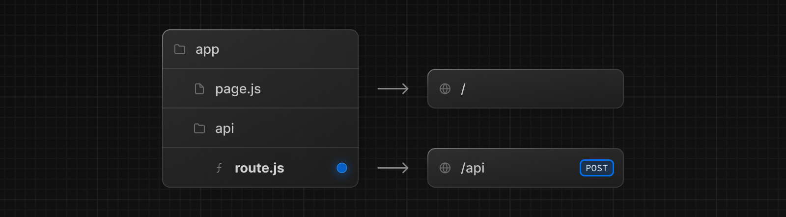

# Route Handlers

Route Handlers를 사용하면 Web Request와 Response API를 사용하여 지정된 경로에 대한 custom request handlers를 만들 수 있다.



> **Good To know**  
>
> Route Handler는 오직 `app`디렉토리 안에서 사용할 수 있다. 

---

## Convention

Route Handler는 `app`디렉토리 내 `route.js | ts`파일에서 정의한다.

`app/api/route.js`

```ts
export async function GET(request: Request) {}
```

Route Handler는 `page.js`나 `layout.js`처럼 `app`디렉토리 내에 중첩해서 만들 수 있다. 하지만, `page.js`와 동일한 경로 세그먼트 레벨에는 `route.js`파일이 있을 수 없다.  

### Supported HTTP Methods

GET, POST, PUT, PATCH, DELETE, HEAD, OPTIONS를 지원한다. 지원되지 않는 메소드가 호출되면 `405 Method Not Allowed`를 반환한다.

### Extended `NextRequest` and `NextResponse` APIs

native Request와 Response외에도 Next.js는 advanced한 사용을 위한 편리한 기능을 제공한다. 공식문서의 [NextRequest](https://nextjs.org/docs/app/api-reference/functions/next-request)와 [NextResponse](https://nextjs.org/docs/app/api-reference/functions/next-response)를 참고하자.

---

## Behavior

### Static Route Handlers

Route Handlers는 반환하는 `Response`객체가 있는  `GET`메소드와 함께 사용할 때 기본적으로 [정적으로 평가](https://nextjs.org/docs/app/building-your-application/data-fetching#static-and-dynamic-data-fetching)된다.

`app/items/route.ts`

```ts
import { NextResponse } from 'next/server';

export async function GET() {
  const res = await fetch('...', {
    headers: {
      'Content-Type': 'application/json',
      'API-Key': process.env.DATA_API_KEY,
    }
  })
  const data = await res.json();
  
  return NextResponse.json({ data });
}
```

> **타입스크립트 사용 시**  
>
> Response.json()은 유효하지만 오류를 표시한다. NextResponse.json()을 대신 사용할 수 있다.

### Dynamic Route Handlers

Route Handlers는 아래와 같은 경우에 동적으로 평가된다.

- `Request`객체가 있는  `GET`메소드와 함께 사용할 때
- 다른 어떠한 HTTP 메소드들
- `cookies`나 `headers`같은 함수를 사용할 때
- Segment Config Option의 dynamic mode를 수동으로 지정했을 때

`app/products/api/route.ts`

```ts
import { NextResponse } from 'next/server'
 
export async function GET(request: Request) {
  const { searchParams } = new URL(request.url)
  const id = searchParams.get('id')
  const res = await fetch(`https://data.mongodb-api.com/product/${id}`, {
    headers: {
      'Content-Type': 'application/json',
      'API-Key': process.env.DATA_API_KEY,
    },
  })
  const product = await res.json()
 
  return NextResponse.json({ product })
}
```

마찬가지로 `POST`메소드를 사용할 때도 동적으로 평가된다.

`app/items/route.ts`

```ts
import { NextResponse } from 'next/server'
 
export async function POST() {
  const res = await fetch('https://data.mongodb-api.com/...', {
    method: 'POST',
    headers: {
      'Content-Type': 'application/json',
      'API-Key': process.env.DATA_API_KEY,
    },
    body: JSON.stringify({ time: new Date().toISOString() }),
  })
 
  const data = await res.json()
 
  return NextResponse.json(data)
}
```

### Route Resolution (경로 확인)

`page.js`와 같은 위치에 있으면 안된다. `page.js` 파일내에 API와 함께 정의해도 안된다.

| Page                 | Route              | Result       |
| -------------------- | ------------------ | ------------ |
| `app/page.js`        | `app/route.js`     | X : Conflict |
| `app/page.js`        | `app/api/route.js` | O : Valid    |
| `app/[user]/page.js` | `app/api/route.js` | O : Valid    |

## Examples

[공식문서에서 확인하자](https://nextjs.org/docs/app/building-your-application/routing/router-handlers#examples)

