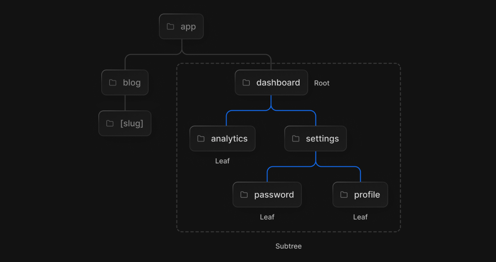
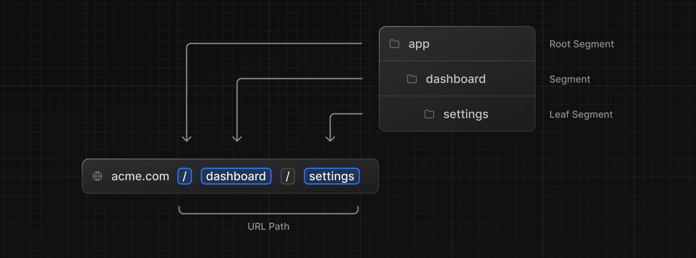
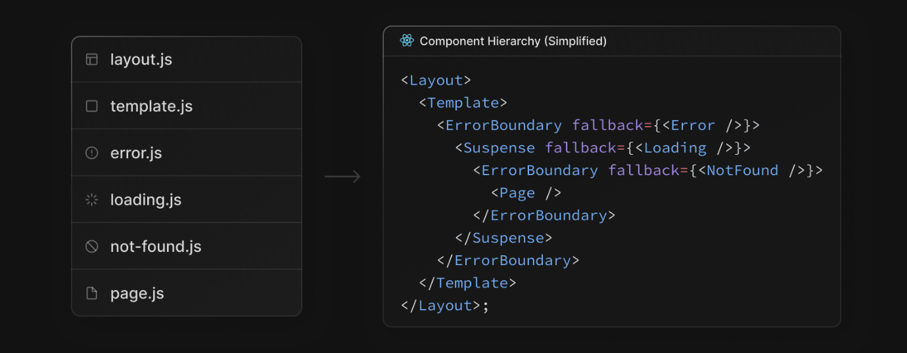
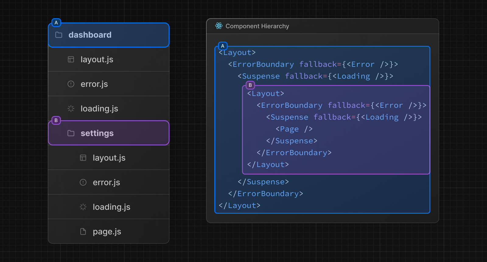

# Routing Fundamentals (라우팅 기본)

Next.js 13은 **<u>리액트 서버 컴포넌트</u>**를 기반으로 구현된 새로운 App Router 를 제공하며 레이아웃, 중첩 라우팅, 로딩 상태, 에러 핸들링을 지원한다.

---

## Terminology (용어)

- Tree : 위계 구조를 시각화.
- SubTree : 트리의 일부로 새로운 루트에서 Leaf까지로 끝난다.
- Root: **트리**나 **서브 트리**에서 첫번 째 노드
- Leaf: 서브 트리의 마지막 노드로, 경로의 URL의 마지막 부분 path를 예로 들 수 있다.

 

- URL Segment : 슬래시를 기준으로 구분되는 URL path의 일부다.
- URL Path : segment 들로 이루어진 도메인 이후 URL 부분이다.

---

## The app Directory (app 디렉토리)

Next.js는 13버전에서 공유 레이아웃, 중첩 라우팅, 로딩 상태, 오류 처리 등을 지원하는 React Server Component를 기반으로 하는 새로운 App Router를 도입했다.  

새로운 App Router는 `app`이라는 이름의 새 디렉토리 안에서 실행된다. `app`디렉토리는 `pages` 디렉토리와 함께 작동하여 점진적으로 채택할 수 있다. 이는 기존의 `pages` 디렉토리가 가지고 있던 다른 라우터들을 유지하면서 새롭게 동작할 수 있도록 하는 선택지를 제공한다.

> **Good To Know**  
>
> App 라우터가 Pages 라우터보다 우선시한다. 따라서, 동일한 URL 경로로 되지 않아야 하며, 충돌을 방지하기 위해 오류를 발생시킨다.

---

## Folders and Files inside app (app 디렉토리 안의 폴더와 파일들)

`app` 디렉토리 안에는 

- 폴더들은 경로를 정의하기 위해 사용된다. 하나의 루트는 중첩된 폴더들의 경로다. 이 루트는 위계 구조에 따라, page.js를 포함한 가장 말단의 leaf folder까지 내려간다.
- 파일들은 각각 세그먼트에서 UI를 생성하기 위해 사용된다. 

---

## Route Segment (경로 세그먼트)

각 폴더는 경로 세그먼트를 나타낸다. 이 경로 세그먼트들은 URL경로에 매핑된다.

---

## Nested Routes(중첩 경로)

중첩 경로를 작성하려면 폴더를 중첩하면 된다. 위 사진의 `/dashboard/settings` 경로는 세 개의 세그먼트로 구성된다.

- `/` : 루트 세그먼트
- `dashboard` : 세그먼트
- `settings` : 리프 세그먼트

---

## File Conventions (파일 컨벤션)

- layout : 공유되는 UI. 각 라우팅 디렉토리에 존재할 수 있다. html과 body 태그를 사용한다.
- page : 라우트를 위한 단일 UI를 생성하고, path를 공개적으로 접근할 수 있게 한다.
- route.js : 루트를 위한 서버사이드 API 엔드 포인트를 생성한다.
- loading.tsx : loading UI
- not-found.tsx : not found UI
- error : Error UI
- global-error : Global Error UI
- template : 하위 요소를 묶는다는 점에서 layout과 비슷하지만 layout은 페이지를 이동할 때 상태가 유지되는 반면, template은 상태가 보존되지 않고, 다시 동기화 된다. 일반적으로 layout을 사용한다.
- default : 병렬 Route Fallback 페이지

## Component Hierarchy (컴포넌트 위계)

- layout.js
- template.js
- error.js (리액트 ErrorBoundary)
- loading.js (리액트 Suspense)
- not-found.js (리액트 ErrorBoundary)
- page.js

중첩이 가능하다.

---

## Colocation (함께 위치하기)

특별한 파일들 외에도 폴더 내에 자신의 파일(컴포넌트, 스타일, 테스트 등)을 함께 위치시킬 수 있는 옵션이 있다.

---

## Server-Centric Routing with Client-side Navigation (클라이언트 측 탐색을 사용한 서버 중심 라우팅)

클라이언트 사이드 라우팅을 제공하는 `pages` 디렉토리와 다르게, `app` 디렉토리 내의 새로운 라우터는 서버 컴포넌트와 서버 측 데이터 패칭을 위해 서버 중심적 라우팅을 사용한다.  

서버 중심적 라우팅에서는 클라이언트가 경로 맵을 다운로드 할 필요가 없으며, 서버 컴포넌트에 대한 동일 요청을 사용해서 경로를 검색할 수 있다. 이 최적화는 모든 응용프로그램에 유용하지만 경로가 많은 응용프로그램에서 더 큰 이점이 있다.  

라우팅 자체는 서버 중심적이지만, 라우터는 Link 컴포넌트로 SPA처럼 클라이언트 사이드 네비게이션을 사용할 수 있다. 이는 사용자가 새 경로로 이동할 때 페이지를 다시 로드하지 않는다는 것이다. 대신, URL이 업데이트되고 Next.js는 변경되는 세그먼트만 리렌더링한다. (바로 밑에서 변경되는 부분만 리렌더링하는 주제를 다룰 것이다.)  

또한 사용자가 탐색할 때 라우터는 React Server 컴포넌트 payload 결과값을 인-메모리 클라이언트 측 캐시에 저장한다. 해당 캐시는 경로 세그먼트별로 분할되므로 모든 수준에서 무효화할 수 있으며 React의 동시적인 렌더들 사이에서 일관성을 유지할 수 있게 한다. 이는 어떠한 특정 상황들에서, 이전에 패치된 세그먼트가 캐시되어 재사용될 수 있음을 뜻하고, 이는 성능을 향상시킨다.

> - [Linking and Navigating](https://nextjs.org/docs/app/building-your-application/routing/linking-and-navigating)
> - [React concurrent](https://react.dev/blog/2022/03/29/react-v18#what-is-concurrent-react)

---

## Partial Rendering (부분적인 렌더링)

형제 경로간 사이에서 탐색할 때(ex. `/dashboard/settings`와 `/dashboard/analytics`),` dashboard/layout.js`의 layout는 그대로 유지하고 dashboard/settings로 들어가면 dashboard/settings/page.js 가 메인에 리렌더링되고, dashboard/analytics로 들어가면 dashboard/analytics/page.js를 렌더한다. 이 때, layout은 리렌더링하지 않는다.

---

## Advanced Routing Patterns (향상된 라우팅 패턴)

App 라우터는 고급 라우팅 패턴을 구현하는데 도움이 되는 규칙을 제공한다.

- 병렬 경로 : 하나의 뷰 안에서 두 개 이상 페이지를 독립적으로 탐방할 수 있는 것을 가능하게 한다. ex. 대시보드
- 경로 가로채기 : 경로를 가로채서 다른 경로의 컨텍스트에 표시할 수 있다. 현재 페이지의 컨텍스트를 유지하는 것이 중요할 때 사용할 수 있다. ex. 피드에서 사진을 확대하거나, 하나의 태스크를 편집하는 동시에 모든 태스크를 보고 싶을 때 이용할 수 있따.

이런 패턴으로 더 풍부하고 복잡한 UI를 구축해서 과거에 복잡했던 기능을 구현할 수 있다.

> 이제 공식문서의 Routing을 따라가면 된다.

> **참고**  
>
> - [Next.js 공식 문서](https://nextjs.org/docs/app/building-your-application/routing)
>
> - [벨로그 라우팅 기본](https://velog.io/@chaewonkang/Next.js-13-1.-Routing-1.1-Routing-Fundamentals)

