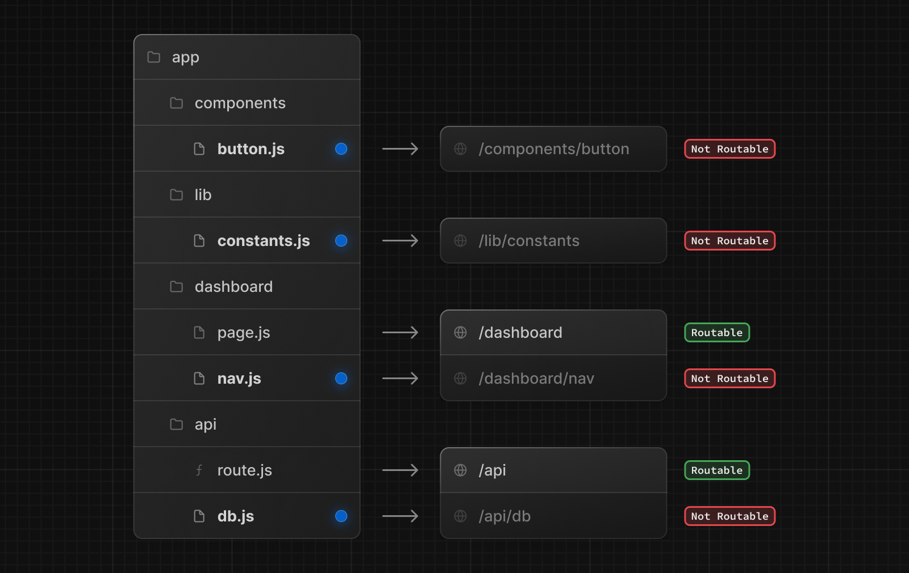
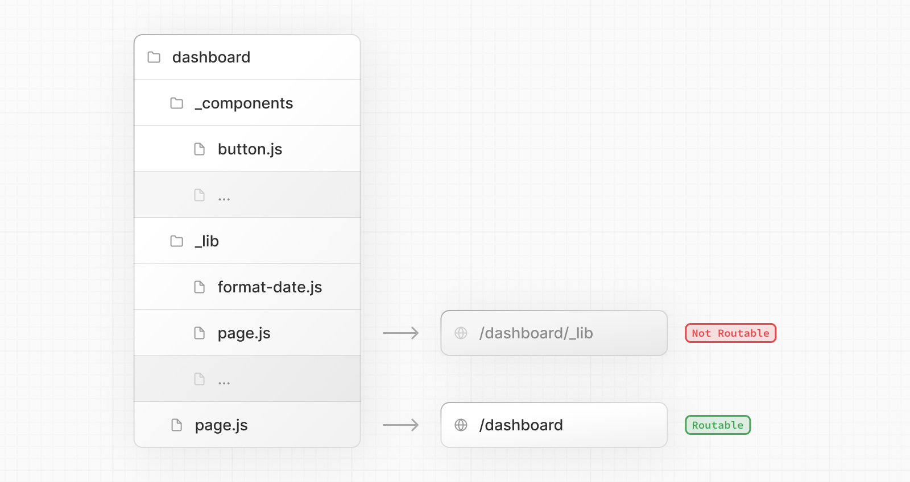
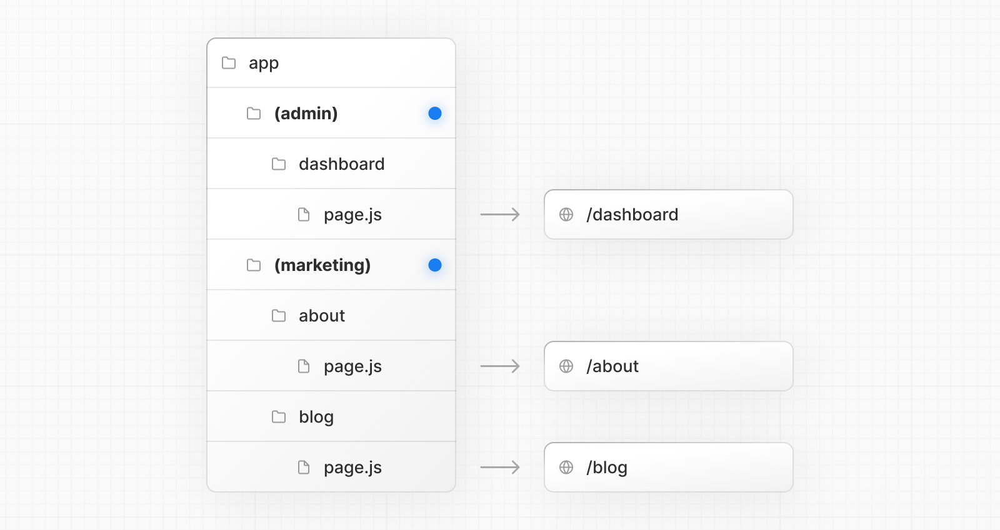
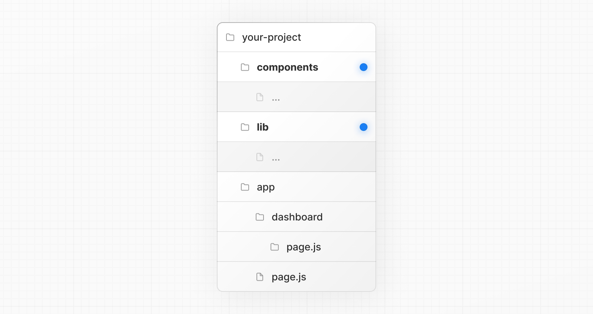
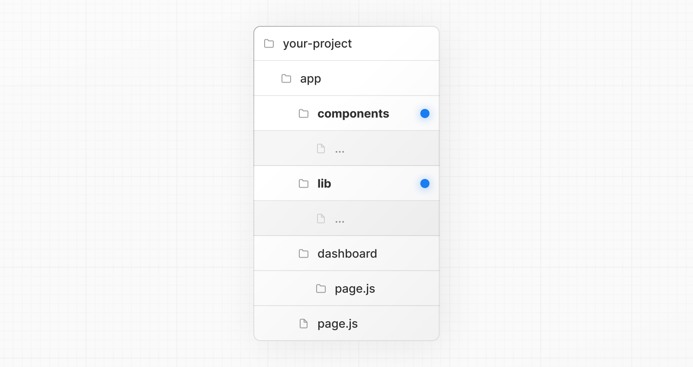
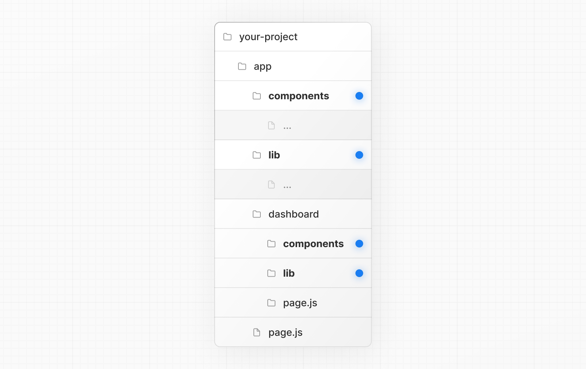

# Project Organization and File Colocation

routing foler와 file convention을 제외하고 Next.js는 프로젝트 파일을 어떻게 구성하고 조합해야 하는지에 대한 의견이 없다.  

이 페이지는 프로젝트를 구성하는데 사용할 수 있는 기본 동작과 기능을 공유한다.

---

## Safe colocation by default

`app`디렉토리안에서 중첩된 폴더 계층은 route 구조를 정의한다.

각 폴더는 URL 경로에서 각 해당 부분에 매핑된 route segment를 나타낸다.  

그러나 폴더를 통해 경로 구조가 정의되더라도 `page.js`또는 `route.js`파일이 경로 세그먼트에 추가될 때까지 경로는 공개적으로 액세스 할 수 없다.  

그리고, 경로를 공개적으로 액세스할 수 있는 경우에도 `page.js` 또는 `route.js`에서 반환한 내용만 클라이언트로 전송된다. 이 의미는 프로젝트 파일을 실수로 라우팅 할 수가 없이 안전하게 배치할 수 있음을 의미한다.



> **Good To Know**  
>
> - 이것은 `pages`내에 있는 모든 파일이 route로 고려되는 `pages`디렉토리랑 다르다. 
> - `app`내에서 프로젝트 파일을 배치할 수 있지만 꼭 그럴필요는 없다. 만약 `app`디렉토리 밖에 두는 것을 선호하면 그렇게 할 수 있다.

---

## Project organization features

Next.js는 프로젝트를 구성하는데 몇 가지 도움을 준다.

### Private Folders

 `_folderName`처럼 폴더명 앞에 언더스코어를 붙임으로서 private한 folder를 만들 수 있다.  

라우팅 시스템에서 고려하면 안된다. 모든 라우팅에서 제외된다.



아래의 경우에 사용하면 유용하다.

- UI 로직과 라우팅 로직의 분리
- 프로젝트 및 Next.js 에코시스템 전반에 걸쳐 내부 파일을 일관되게 구성한다.
- 파일을 정리하고 그룹화한다.
- 향후 Next.js 파일 규칙과 이름이 충돌되는 경우를 방지할 수 있다.

> **Good To know**  
>
> - 폴더 이름 앞에 `%5F`를 붙여서 `%5FfolderName`을 만들면 언더스코어로 시작하는 URL세그먼트를 만들 수 있다.

### Route Groups

경로 그룹은 괄호로 묶는다. `(folderName)  `

이는 폴더가 구성하는 목적이고 URL의 일부로 포함되면 안된다는 것을 나타낸다.  



이럴 때 사용하면 유용하다.

- URL에 영향받지 않으면서 섹션, 의도, 팀에 따라 구성
- 같은 Route Segment에서 중첩된 레이아웃 사용하기
  - [멀티 root layout만들기](https://nextjs.org/docs/app/building-your-application/routing/route-groups#creating-multiple-root-layouts)
  - [여러 Route에서 공통적으로 사용할 레이아웃 만들기](https://nextjs.org/docs/app/building-your-application/routing/route-groups#creating-multiple-root-layouts)

### `src`디렉토리

Next.js는 어플리케이션 코드를 `src`에 보관하는 것을 지원한다. 이것은 대부분 프로젝트의 루트에 있는 프로젝트 Config 파일로부터 응용 프로그램 코드를 분리한다.


### Module Path Aliases

Next.js는 중첩된 프로젝트 파일을 쉽게 불러올 수 있도록 [Module Path Aliases](https://nextjs.org/docs/app/building-your-application/configuring/absolute-imports-and-module-aliases)를 지원한다.

```js
// before
import { Button } from '../../../components/button'
 
// after
import { Button } from '@/components/button'
```

---

## Project organization strategies

정답은 없다. 밑에 일반적인 전략에 대한 개요들이 나와있다.

> **Good to Know**  
>
> 아래 예제에서 `components`나 `lib`는 예시일 뿐이다. 특수한 폴더명이 아니다. `ui`, `utils`, `hooks`, `syltes` 등을 사용할 수 있다.

### Store project files outside of `app`

이 전략은 모든 응용프로그램 코드를 프로젝트 루트 공유 폴더에 저장하고, 라우팅 목적으로만 `app`디렉토리를 사용하는 방법이다.



### Store project files in top-level folders inside of `app`

이 전략은 모든 어플리케이션 코드를 root에 `app`디렉토리 안에 보관하는 것이다.



### Split project files by feature or route

이 전략은 글로벌하게 공유된 응용 프로그램 코드를 루트 `app`디렉토리에 저장하고 더 구체적인 응용프로그램 코드들은 경로 세그먼트로 분할한다.


