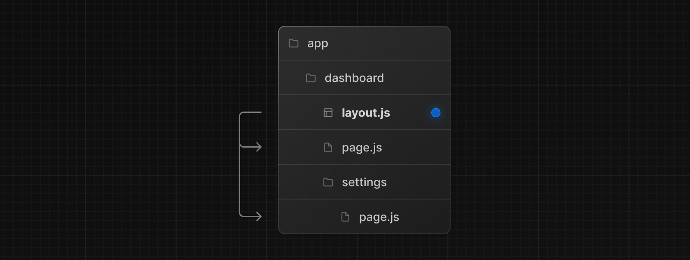
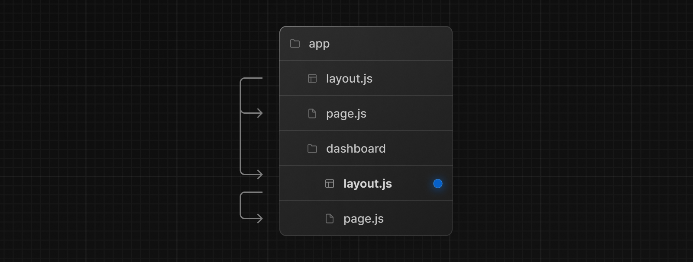

> Routing Fundamentals 와 Defining Routes 페이지를 먼저 읽고 오기를 추천한다.

Next.js 13의 앱 라우터는 page, layout, template을 쉽게 만들 수 있는 파일 규칙을 도입했다. 이 페이지에서는 이런 특수 파일을 사용하는 방법을 안내한다.

---

## Page

페이지는 경로에서 고유한 UI다. `page.js` 파일로부터 컴포넌트를 exporting해서 페이지를 정의할 수 있다. 우선 `app`디렉토리 아래에 page.js를 만들어서 루트에서 보여줄 UI를 만들자.

`app/page.tsx`

```tsx
// `app/page.tsx` is the UI for the `/` URL
export default function Page() {
  return <h1>Hello, Home page!</h1>;
}
```

`app/dashboard/page.tsx`

```tsx
// `app/dashboard/page.tsx` is the UI for the `/dashboard` URL
export default function Page() {
  return <h1>Hello, Dashboard Page!</h1>
}
```

> **Good To Know**  
>
> - 페이지는 항상 서브 트리의 leaf다.
> - `page.js`가 있어야 라우트 세그먼트가 만들수 있고 public하게 접근할 수 있다.
> - 페이지들은 데이터를 fetch할 수 있다. Data Fetching 섹션을 봐서 정보를 얻을 수 있다.

---

##  Layouts

레이아웃은 여러 페이지 간 공유되는 UI다. 탐색 시 레이아웃은 상태를 유지하고 상호작용을 보존하고 다시 렌더링하지 않는다. 레이아웃을 중첩할 수도 있다. 아래에서 살펴볼 예정이다.  

`layout.js` 에서 default exporting으로 React Component를 정의할 수 있다. layout 컴포넌트는 렌더링 중에 하위 레이아웃(있을 경우) 또는 하위 페이지로 채워질 `children` prop을 받아야 한다.



`app/dashboard/layout.tsx`

```tsx
export default function DashboardLayout({
  children, // will be a page or nested layout
} : {
  children: React.ReactNode;
}) {
  return (
    <section>
      {/* Include shared UI here e.g. a header or sidebar */}
      <nav></nav>
      {children}
    </section>
  )
}
```

> **Good To Know**  
>
> - 모든 경로 세그먼트는 선택적으로 자체 layout을 포함할 수 있다. 이런 레이아웃은 해당 세그먼트 모든 페이지에서 공유된다.
>   - 각 경로 레이아웃은 기본적으로 중첩되고 `children` 으로 래핑된다.
>   - <u>**Route Groups**</u>(경로 그룹)을 사용하여 특정 경로 세그먼트에서 공유 레이아웃을 선택할 수 있다.
> - layout은 기본적으로 서버 구성요소지만, 클라이언트 구성요소로 설정할 수 있다.
> - layout에서 데이터를 가져올 수 있다. **<u>Data Fetching</u>** 섹션을 참고하자.
> - 부모 레이아웃, 자식 레이아웃간에 데이터를 전달할 수 없다. 하지만, 라우트에서 같은 데이터는 두 번 이상 fetch할 수 있다. React는 성능에 영향을 주지 않고 중복된 요청을 자동으로 제거한다.
> - 기본적으로 layout들은 현재 라우트 세그먼트에 접근할 수 없다. 라우트 세그먼트에 접근하려면 클라이언트 컴포넌트에서 `useSelectedLayoutSegement` 또는 `useSelectedLayoutSegments`를 사용해야 한다.

---

## Root Layout (필수)

root layout은 `app`디렉토리에서 정의되어야 하며 모든 라우터들에 적용된다. 이 레이아웃을 사용하면 서버에서 반환되는 초기 HTML을 수정할 수 있다. 

```tsx
export default function RootLayout({
  children
}: {
  children: React.ReactNode;
}) {
  return (
    <html lang="ko">
      <body>{children}</body>
    </html>
  )
}
```

> **Good To Know**  
>
> - `app` 디렉토리는 반드시 root layout을 포함해야 한다.
>
> - root layout은 html과 body태그를 포함해야 한다. 자동으로 생성해주지 않는다.
>
> - [built-in SEO support](https://nextjs.org/docs/app/building-your-application/optimizing/metadata)를 사용해서 `<head>` HTML 요소를 관리할 수 있다. 예를 들어서 `<title>`같은 요소를!
>
> - 멀티 root layout을 만들고 싶은 경우에는 [Route Groups](https://nextjs.org/docs/app/building-your-application/routing/route-groups#creating-multiple-root-layouts)를 사용하여 multiple root layouts 를 사용할 수 있다.  
>
>   아래 사진을 보면, (marketing)과 (shop)은 자신의 layout을 갖는다.
>
>   
>
> - **root layout은 기본적으로 서버 컴포넌트이므로 클라이언트 컴포넌트로 사용할 수 없다.**

---

## Nesting Layout

app/layout.js 아래에 app/dashboard/layout.js가 래핑되고 app/dashboard/page.js가 자식으로 들어가게 된다.



`app/dashboard/layout.tsx`

```tsx
export default function DashboardLayout({
  children
}: {
  children: React.ReactNode;
}) {
  return <section>{children}</section>
}
```

---

## Template

템플릿은 하위 요소를 묶는다는 점에서 레이아웃과 유사하다. 하지만, 템플릿을 공유하고 있는 각 경로를 탐색하게 되면 새 인스턴스가 마운트되고 DOM요소가 다시 생성되며 상태가 보존되지 않는다.  

이런 특정 동작이 필요한 경우에만 사용한다.

- CSS 또는 애니메이션 라이브러리를 사용하여 애니메이션을 입력 및 종료할 때
- 의존적인 기능 useEffect(예. 페이지 보기 로깅), useState(예. 페이지당 피드백 양식)
- 기본 프레임워크 동작을 변경시킨다. 레이아웃의 Suspense는 레이아웃이 처음 로드될 때만 fallback을 표시한다. template의 경우 매 탐색간 fallback이 표시된다.

> 특별한 이유가 없는 한 layout을 사용하는 것이 좋다.

---

## <head>수정하기

`title`과 `meta`를 사용하기 위해서 [built-in SEO support](https://nextjs.org/docs/app/building-your-application/optimizing/metadata)를 참고하자.

`metadata` object를 내보내거나 `generateMetadata` 함수를 layout.js 나 page.js 파일에서 사용함으로서 metadata를 정의할 수 있다.

`app/page.tsx`

```tsx
import { Metadata } from 'next';

export const metadata: Metadata = {
  title: '이 페이지 title입니다',
}

export default function Page() {
  return '...';
}
```

> **Good to know**  
>
> `<head>`태그를 root layout에 수동으로 추가하면 안된다.
