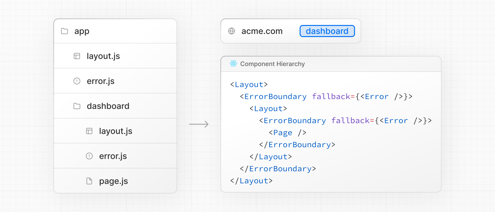

# Error Handling

`error.js`  파일 컨벤션을 사용하면 중첩된 경로에서 런타임 에러를 정상적으로 처리할 수 있다.

- 전체 페이지를 다시 로드하지 않고 오류 복구를 시도하는 기능을 추가할 수 있다.
- 앱의 나머지 부분은 그대로 동작하도록 하고 영향을 받는 부분에 대한 오류를 처리한다.

error.js 파일에 error UI를 만들고 route segment에 넣고 export한다.


`app/dashboard/error.tsx`

```tsx
'use client'; // Error components는 반드시 Client Component여야 한다.

import { useEffect } from 'react';

export default function Error({
  error,
  reset,
}: {
  error: Error;
  reset: () => void;
}) {
  useEffect(() => {
    // 에러 보고 서비스에 에러 로그를 남긴다.
    console.log(error);
  }, [error])
  
  return (
    <div>
      <h2>Something went Long!</h2>
      <button onClick={() => reset()}>Try Again</button>
    </div>
  )
}
```

---

## `error.js`는 어떻게 동작하는가?


- `error.js`는 page.js 컴포넌트를 래핑하는 ErrorBoundary를 자동으로 생성한다.
- `error.js` 파일에서 내보낸 컴포넌트가 fallback컴포넌트로 사용된다.
- errorboundary내에서 에러가 발생하면 fallback컴포넌트가 렌더링된다.
- fallback 에러 컴포넌트가 활성화되면 errorboundary위에 있는 레이아웃은 유지되고 상호작용을 그대로 할 수 있으며 오류 컴포넌트는 복구 기능을 표시할 수 있다.

---

## Recovering Frome Errors

오류의 원인은 일시적일 수 있다. 이 경우 다시 시도하기만 하면 문제가 해결될 수 있다.  

에러 컴포넌트는 `reset()` 기능을 사용할 수 있고 error로부터 신속히 복구할 수 있다. error가 실행되면 errorboundary 컨텐츠는 리렌더링을 시도한다. 만약 성공하면, fallback 에러 컴포넌트는 리렌더링 결과물로 교체된다.

---

## Nested Routes

이런 특수한 파일들은 특정 계층으로 렌더링된다.  

예를 들어서, `layout.js`와 `error.js` 둘 다 있는 중첩된 경로의 경우 아래와 같은 컴포넌트 계층으로 렌더링된다.



- 오류는 가장 가까운 errorboudnary까지 버블링된다. 중첩된 경로 폴더에 `error.js`파일을 배치하면 다소 사소한 error UI도 렌더할 수 있다.
- `error.js` 바운더리는 같은 route 경로에 있는 `layout.js`컴포넌트에서 던지는 에러를 다루지 않는다. 레이아웃 컴포넌트 안에 error boundary가 있기 때문이다.

---

## Handling Errors in Layouts

`error.js` 바운더리에서 같은 경로에 있는 `layout.js` 나 `template.js`에서 발생하는 에러를 잡지 않는다. 이 의도적인 계층은 에러가 발생했을 때 공유되고 있는 형제 라우트(네비게이션 같은) 중요한 요소들이 계속 보이고 동작하게 해준다.  

만약, layout이나 template에서 발생하는 에러를 잡고 싶다면 상위에 `error.js`를 배치해야 한다.  

루트 레이아웃이나 template 오류를 처리하려면 `global-error.js`라는 error.js 변형을 사용해야 한다.

---

## Handling Errors in Root Layouts

일반 `error.js`와 달리 `global-error.js`를 root에서 사용하는데 전체 어플리케이션은 래핑하고 active 시 fallback 컴포넌트가 root layout을 대체한다. 따라서, `global-error.js`는 `<html>`과 `<body>`태그를 포함해야 한다.  

다른 error.js가 대부분 오류를 잡아주기 때문에 자주 트리거되지는 않는다.  

만약, `global-error.js`를 root에서 선언했더라도 root에서 `error.js`를 생성해주는 것이 좋다. (공유 UI인 root layout이 유지된 상태로 하위 컴포넌트만 교체할 수 있으니까)

`app/global-error.tsx`

```tsx
'use client'
 
export default function GlobalError({
  error,
  reset,
}: {
  error: Error
  reset: () => void
}) {
  return (
    <html>
      <body>
        <h2>Something went wrong!</h2>
        <button onClick={() => reset()}>Try again</button>
      </body>
    </html>
  )
}
```

---

## Handling Server Errors

만약에 data fetching 중이나 Server Component에서 에러가 발생했다면 Next.js는 가까운 `error.js`파일로 `error` prop을 전달할 것이다.  

`next dev`가 실행중일 때 `error` 는 직렬화되고 서버컴포넌트로부터 client `error.js`로 전달될 것이다. 보안을 보장하기 위해 production환경에서 `next start`를 실행할 때 일반적인 에러 메세지가 에러 메세지의 해시가 포함된 `.digest`와 함께 `error`가 전달된다. 이 해시는 서버 로그에서 사용할 수 있다.