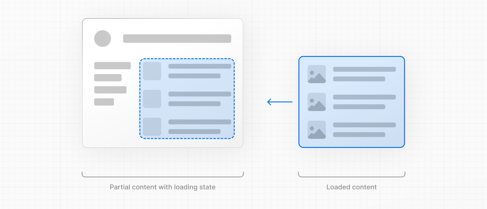

# Loading UI and Streaming

특별한 파일인 `loading.js`는 React Suspense와 함께 Loading UI를 만들 수 있도록 도와준다. 이 컨벤션을 사용하면 경로 세그먼트로부터 컨텐츠를 로드하는 동안 로드 상태를 표시할 수 있으며, 렌더링이 완료되면 새 컨텐츠가 자동으로 스왑된다.



---

## 로드 상태

로드 상태는 탐색 시 표시되는 fallback UI다. 스켈레톤, 스피너같은 로딩 표시기 같은 것을 미리렌더링할 수 있다.

`app/dashboard/loading.tsx`

```tsx
export default function Loading() {
  return <LoadingSkeleton />
}
```

React에서 `<Suspense>`의 fallback으로 컴포넌트가 들어가게 되고 `<Page />`를 감싼다.


---

## Streaming with Suspense

