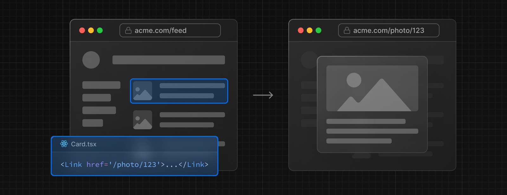
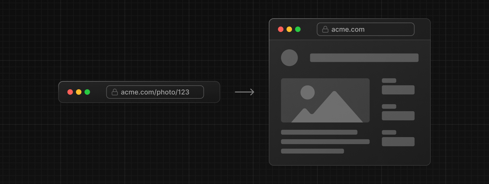
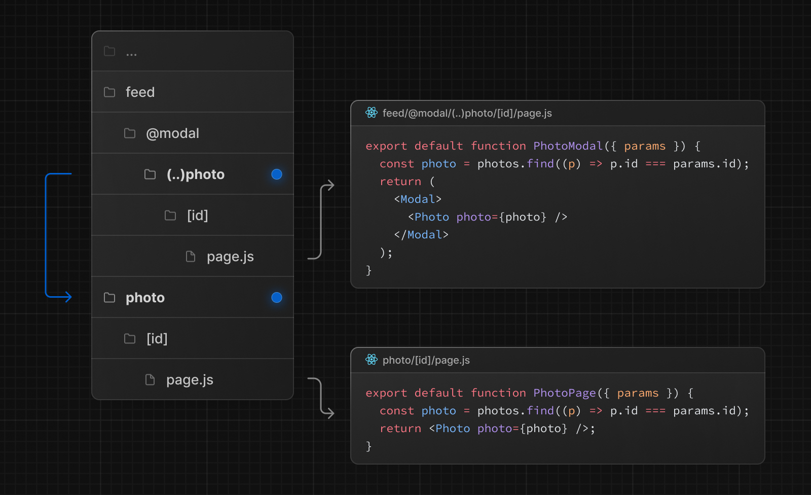

# Intercepting Routes

이 라우팅 패러다임은 특정 경로를 가로채서(intercept) 현재 레이아웃을 유지하면서 다른 route를 표시할 때 유용하다.  

예를 들어, 피드내에서 사진을 클릭할 때 모달에 사진이 표시되야 한다. 이 경우에 Next.js는 `/feed`경로를 가로채서(intercept)  `/photo/123` 를 표시한다.

하지만, 공유 가능한 URL을 통해 접속하거나 페이지를 새로 고침하면 모달 대신 전체 사진이 렌더링되어야 한다. 즉, route intercept가 발생하면 안된다.

---

## Convention

Intercepting routes는 `(..)`컨벤션을 사용해서 정의할 수 있다. 상대 경로 규칙 `../`과 유사하지만 세그먼트에 대한 것이다.  

사용할 수 있는 컨벤션은 다음과 같다.

- `(.)` : 같은 level의 세그먼트를 match한다.
- `(..)` : 한단계 위 level의 세그먼트를 match한다.
- `(..)(..)` : 두단계 위 level의 세그먼트를 match한다.
- `(...)` : root `app`디렉토리의 세그먼트를 match한다.

예를 들어, `feed`세그먼트내에 `(..)photo`디렉토리를 만들었기 때문에 `feet`세그먼트에서는 이제 `photo`세그먼트를 가로챌 수 있다.

> `(..)` 컨벤션은 파일 시스템 기준이 아니라, route segments에 기본한다는 것을 기억하자.

---

## Examples

Intercepting Routes는 Parallel Routes와 함께 사용해서 모달을 만들 수 있다.  

이 패턴을 사용해서 모델을 작성하면 몇 가지 문제를 해결할 수 있고, 다음 작업을 수행할 수 있다.

- URL을 통해 모달 컨텐츠를 공유할 수 있도록 설정 (위 예시처럼 URL만으로 feed에서 레이아웃을 유지하면서 불러왔다.)
- 페이지를 **새로 고침할 때** 모달을 닫는 대신 context 유지.
- **뒤로가기 시** 이전 경로로 이동하지 않고 모달 닫기.
- **앞으로 가기 시** 모달 다시 열기.

> 이 예제에서 `@modal`은 세그먼트가 아닌 슬롯이므로 `photo`세그먼트에 대한 route를 `(..)`로 캐치할 수 있다.

이렇게 사용하는 다른 예제는 `/login`페이지가 있을 때 navbar에서 로그인 클릭 시 `/login`모달을 열거나 sidebar에서 쇼핑 카트를 여는 것 등이 포함 될 수 있다.  

실제로 어떻게 사용되는지는 [vercel에서 제공하고 있는 예제](https://github.com/vercel-labs/nextgram/blob/main/app/page.js)를 볼 수 있다. 예제를 보면 이해가 빠르다.

