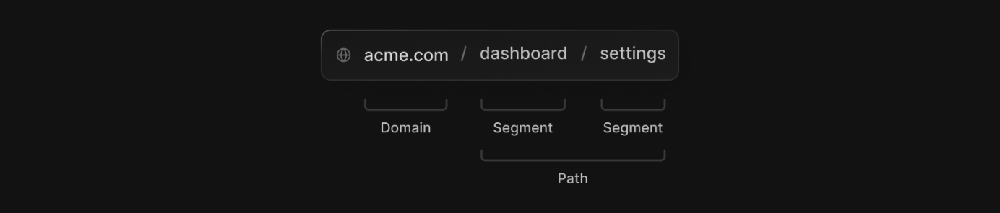

# Routing Fundamentals (라우팅 기본)

Next.js 13은 **<u>리액트 서버 컴포넌트</u>**를 기반으로 구현된 새로운 App Router 를 제공하며 레이아웃, 중첩 라우팅, 로딩 상태, 에러 핸들링을 지원한다.

## Terminology (용어)

- Tree : 위계 구조를 시각화.
- SubTree : 트리의 일부로 새로운 루트에서 Leaf까지로 끝난다.
- Root: **트리**나 **서브 트리**에서 첫번 째 노드
- Leaf: 서브 트리의 마지막 노드로, 경로의 URL의 마지막 부분 path를 예로 들 수 있다.

 

- URL Segment : 슬래시를 기준으로 구분되는 URL path의 일부다.
- URL Path : segment 들로 이루어진 도메인 이후 URL 부분이다.

## The app Directory (app 디렉토리)

새로운 app Router는 

> **참고**  
>
> [벨로그 라우팅 기본](https://velog.io/@chaewonkang/Next.js-13-1.-Routing-1.1-Routing-Fundamentals)

