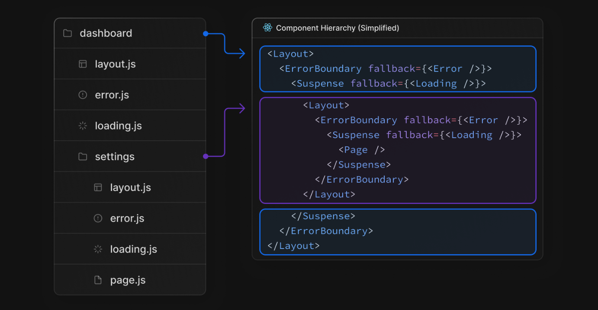

## 설치

---

## 빠른 설치

`npx create-next-app@latest`

## 수동 설치

1. 설치

   `npm i next@latest react@latest react-dom@latest`

2. pacakge.json 설정

   ```json
   {
     "scripts": {
       "dev": "next dev",
       "build": "next build",
       "start": "next start",
       "lint": "next lint"
     }
   }
   ```

3. app 폴더 생성하기

   app폴더 아래에 layout.tsx, page.tsx를 만든다. /(루트)경로 방문 시 렌더된다.

   `app/layout.tsx`

   ```tsx
   export default function RootLayout({
     children,
   }: {
     children: React.ReactNode;
   }) {
     return (
       <html lang="en">
         <body>{children}</body>
       </html>
     );
   }
   ```

   `app/page.tsx`

   ```tsx
   export default function Page() {
     return <h1>Hello, Next.js!</h1>;
   }
   ```

   > **알아두면 좋은 것**  
   >
   > layout.tsx를 만드는 것을 잊어버렸다면 자동적으로 next dev할 때 생성된다.

 4.  public 폴더 생성하기

     선택적으로 public을 만들 수 있다. 이미지, 글꼴 등 정적 asset을 저장한다. code상 경로는 `/`로 접근할 수 있다.


## package.json

- dev: `devlopment mode`로 Nex.js를 실행한다.
- build: production에서 사용을 위해 빌드한다.
- start: Next.js production 서버를 시작한다.
- lint: ESLint 설정한다.

 <br />

## 구조

---

### Top-level files

- `next.config.js` : Next.js를 위한 환경설정 파일
- [`middleware.ts`](https://nextjs.org/docs/app/building-your-application/routing/middleware) : Next.js 미들 웨어설정 파일
- `.env` : 환경 변수
- `.env.local` : 로컬 환경 변수
- `.env.production` : 프로덕션 환경 변수
- `.env.development` : 개발 환경 변수
- `.next-env.d.ts` : Next를 위한 Typescript 선언 파일

<br />

### Top-Level folders

- app : app router
- pages : pages router
- public : asset
- src : 선택적 응용 프로그램 원본 폴더

<br />

### 라우팅 파일

> js, jsx, tsx 다 가능하다.

- layout : 공유되는 UI. 각 라우팅 디렉토리에 존재할 수 있다. html과 body 태그를 사용한다.
- page : page
- loading.tsx : loading UI
- not-found.tsx : not found UI
- error : Error UI
- global-error : Global Error UI
- template : Re-renderd layout
- default : 병렬 Route Fallback 페이지

> js, ts만 가능하다.

- route : API endpoint


중첩이 가능하다.



<br />

### 동적 경로

- `[folder]` :  동적 경로 세그먼트
- `[...folder]` : 모든 세그먼트 캡처
- `[[...folder]]` : 모든 세그먼트(선택 사항) 캡처

<br />

### 라우팅 그룹 및 개인 폴더

- `(folder)` : 라우팅에 영향을 미치지 않고 경로 그룹화
- `_folder` : 폴더 및 모든 하위 세그먼트가 라우팅되지 않도록 선택

<br />

### 병렬 몇 인터셉트된 경로

