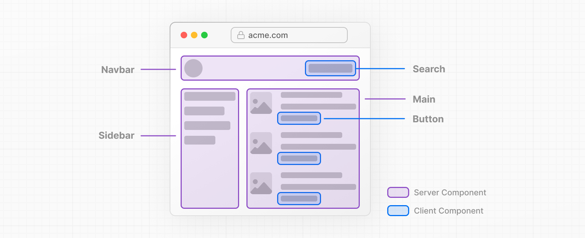

> 13.4 버전 공식문서를 번역하면서 공부한 기록.

## 주요 기능

- **라우팅**  
  레이아웃, 중첩 라우팅, 로드 상태, 오류 처리 등을 지원하는 서버 요소 위에 구축된 파일 시스템 기반 라우터
- **렌더링**
- **데이터 가져오기**
- **스타일링**  
  CSS Modules, TailwindCSS, CSS-in_JS 모두 지원한다.
- **최적화**  
  이미지, 글꼴, 스크립트 최적화를 통해 Core Web Vitals과 유저 경험을 향상시킬 수 있다.
- **Typescript**  
  Typescript에 대한 지원이 향상되었다.

 

## 문서 사용 방법

기본에서 고급까지 있어서 순서대로 따라가면 된다. 사용사례로 건너뛸 수도 있다.

 

## 사전 요구 사항 지식

- 리액트 공식 문서
- 리액트 에센셜

 

> 아래는 React Docs에 있는 리액트 에센셜 발췌 내용이다.

## 리액트 에센셜

## Sever Components

### Thinking in Server Components

React Server Components는 목적에 따라 유연하게 렌더링할 위치를 클라이언트 or 서버로 선택할 수 있다.

페이지를 작은 컴포넌트로 분할할 경우, 대부분 컴포넌트는 상호작용이 불필요한 컴포넌트고 서버에서 렌더링될 수 있다. 작은 상호작용 UI의 경우 클라이언트 컴포넌트에서 뿌릴 수 있다. 이는 Next.js의 서버 우선 접근 방식과 일치한다.

### Why Server Components? (서버 컴포넌트를 선택해야 하는 이유)

클라이언트 컴포넌트에 비해 서버 컴포넌트를 사용했을 때 이점은 무엇일까? 서버 컴포넌트를 사용해서 

 

> 아래는 Next.js에서 React Server Component와 Client Server에 대해 알아본다.
> https://kulkarniankita.com/react/react-server-client-components

Next.js에서 app 디렉토리에서 기본적으로 모든 컴포넌트들은 서버 컴포넌트다. 리액트 서버 컴포넌트와 클라이언트 컴포넌트에 대해 깊게 알아보자.

## Serialization이란 무엇인가?

직렬화란 클라이언트 및 서버 컴포넌트 어떤 것을 사용할지 확인하는 데 중요한 항목이다. 이유는 나중 게시글에서 알아본다. 직렬화는 파일 시스템, DB, 메모리에 객체를 저장할 수 있도록 바이트 스트림으로 변환하는 프로세스다. 객체를 바이트 스트림으로 변환하지 않으면 파일 시스템, DB, 메모리는 이해할 수 없어서 작동하지 않는다.

 

## React Server Component란 무엇일까?

리액트 서버 컴포넌트들은 서버에서 렌더링되고 요청되는 컴포넌트들이다. 만약, 클라이언트 쪽 번들에서 찾는다면 존재하지 않을 것이다.

### 리액트 서버 컴포넌트들의 특징들

- 서버 컴포넌트들은 onClick 같은 상호작용성을 포함하지 않는다.
- fallback, 함수들은 props로 전달할 수 없다.
- 상호작용하지 않기 때문에 React State가 필요 없다.
- 서버 컴포넌트들은 리액트의 Life Cycle Hooks를 사용하지 않는다.
- 백엔드 부분이라고 생각하면 이해가 될 것이다.
- 데이터 베이스 or 파일 시스템 기반 작업, 상호 작용이나 수명 주기 훅스가 없는 모든 컴포넌트가 예시다.