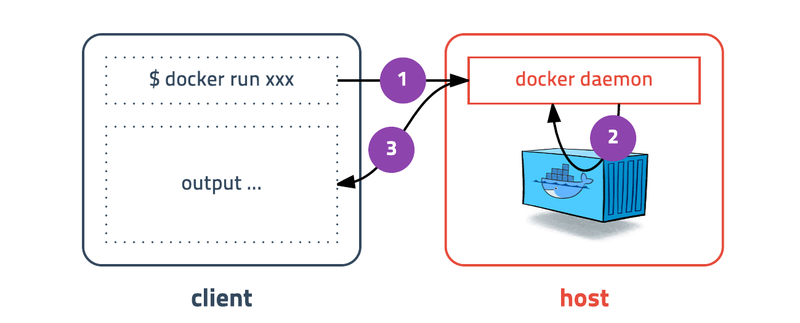

## Docker를 사용하는 이유

- 환경에 구애받지 않고 어플리케이션을 신속하게 배포 및 확장할 수 있고, 코드가 문제없이 실행될 것을 확신할 수 있다.
- 언제 어디서나 실행할 수 있는 단일 객체를 확보할 수 있다.
- Docker의 간단한 구문을 사용해서 완벽하게 제어할 수 있다.
- 손쉽게 분산 마이크로서비스 아키텍처를 구축 및 실행하고, 표준화된 지속적 통합 및 지속적 전달 파이프라인을 통해 코드를 배포하고, 확장 가능한 데이터 처리 시스템을 구축하고, 개발자를 위한 완전 관리형 플랫폼을 생성할 수 있다. AWS와 Docker의 최근 협업으로 Docker Compose 아티팩트를 Amazon ECS 및 AWS Fargate에 쉽게 배포할 수 있게 되었다.

<u>[AWS | Docker란 무엇인가?](https://aws.amazon.com/ko/docker/) - 참조</u>


## Docker에 대해 더 알아보자.

- VM방식인 호스트OS위에 게스트OS전체를 가상화하여 사용하는 방식이 아니라 프로세스를 격리하는 방식이다. 그래서 가볍고 빠르게 동작한다. 하나의 서버에서 여러 컨테이너를 실행하면 서로 영향을 미치지 않고 독립적으로 실행되어 마치 가벼운 VM을 사용하는 느낌을 준다.
- 실행중인 컨테이너에 접속해서 명령어를 입력할 수 있고 `apt-get`이나 `yum`으로 패키지를 설치할 수도 있다.
- 호스트의 특정 포트와 연결하거나, 호스트의 특정 디렉토리를 내부 디렉토리인 것처럼 사용가능하다.
- 새로운 컨테이너를 만드는 시간은 1-2초로 가상머신과 비교도 안되게 빠르다.
- 도커에서 중요한 개념은 컨테이너 다음으로 **이미지**라는 것이 있다. **컨테이너 실행에 필요한 파일, 설정값 등을 포함하고 있는 것**이다. 한마디로 실행하기 위한 모든 정보를 가지고 있다. **상태값을 가지지 않고 변하지 않는다.** 같은 이미지에서 여러 컨테이너를 생성할 수 있고 컨테이너의 상태가 바뀌거나 삭제되더라도 이미지는 변하지 않는다.
- 이제 새로운 서버가 추가되면, 미리 만들어놓은 이미지를 다운받고 컨테이너를 생성만 하면 된다.
- 도커 이미지는 Docker hub에 등록해서 공개할 수 있다. Docker hub에는 도커에서 제공하는 기본 이미지들이 있고 ruby, golang, java, python 등 공식 이미지가 저장되어 있다. 회원가입만 하면 대용량 이미지를 무료로 저장할 수 있다. 하지만 모든 이미지는 공개되어 누구든 접근 가능하므로, 비공개로 하려면 유료 서비스를 사용햏야 한다.
- 사내 혹은 개인용으로 만들어진 이미지들을 저장하기 위해서는 docker registry를 이용할 수 있다.  
  <u>[docker registry를 사용하는 방법](https://luran.me/441) - 참조</u>
- 도커 이미지는 컨테이너를 실행하기 위한 모든 정보를 담고 있어서 보통 용량이 수백메가에 이른다. 도커는 이런 문제를 해결하기 위해 **레이어**라는 개념을 사용하고, 유니온 파일 시스템을 이용해 여러 레이어를 하나의 파일 시스템으로 사용할 수 있게 해준다. **이미지는 여러 개의 읽기 전용 레이어로 구성**되고, 파일이 추가 및 수정되면 새 레이어가 생성된다. ubuntu 이미지가 A+B+C 집합이라면 ubuntu 이미지를 베이스로 만든 nginx 이미지는 A+B+C+nginx가 된다. 여기서 webapp이미지를 nginx이미지 기반으로 만들면 A+B+C+nginx+source 레이어가 된다. 만약 webapp 소스를 수정하면 A+B+C+nginx 레이어를 제외한 source(v2) 레이어만 다운받으면 되서 효율적으로 이미지를 관리할 수 있게 된다.
- 컨테이너를 생성할 때도 레이어 방식을 그대로 사용한다. 기존 이미지 레이어 위에 읽기/쓰기 레이어를 추가한다. 컨테이너가 실행 중 생성하는 파일 및 변경하는 내용은 읽기/쓰기 레이어에 저장한다.
- 이미지는 url방식으로 관리하며, 태그를 붙일 수 있다. 예를 들어 ubuntu14.04 이미지는 `docker.io/library/ubuntu:14.04` 또는 `docker.io/library/ubuntu:trusty`이고 `docker.io/library`는 생략 가능해서 `ubuntu:14.04`로 사용할 수 있다. 이런 방식은 이해하기 쉽고 편안하게 사용가능하게 해준다.
- 도커는 이미지 파일을 만들기 위해서 `Dockerfile`이란 파일 자체에 자체 DSL(Domain-specific Language)언어를 이용하여 이미지 생성과정을 적는다. 더이상 서버에 각종 의존성 패키지를 설치하면서 어디에 적어놓지 않아도 `Dockerfile`로 관리할 수 있다. 이 파일은 소스와 함께 버전관리되고 원하면 누구든 이미지 생성과정을 보거나 수정할 수 있다.
- Docker는 변경 불가능한 인프라다. 변경을 하려면 도커는 서버를 통째로 바꾸는 개념으로 생각하자. 새로운 도커 이미지 자체를 컨테이너에 담는다. 기존 버전은 컨테이너에서 삭제하는 것.

<u>[초보를 위한 도커 안내서](https://subicura.com/2017/01/19/docker-guide-for-beginners-1.html) - 참조</u>

<br />

## 도커 설치하고 컨테이너 실행하기

[초보를 위한 도커 안내서 - 설치하고 컨테이너 실행하기](https://subicura.com/2017/01/19/docker-guide-for-beginners-2.html) - 참조

맥에 도커를 설치하면 네이티브스럽게 설치된 것 같지만, 도커는 리눅스 컨테이너라서 실제로는 가상머신에 설치가 되어있다. 사용자는 가상머신을 사용한다는 느낌이 전혀 들지 않는데, 그런 부분을 굉장히 신경써서 설계했다. 예를 들면, 포트를 연결하기 위해 도커 컨테이너의 특정 포트를 가상머신에 먼저 연결한 뒤, 다시 mac 포트와 연결해야 하거나 디렉토리를 연결하려고 하면 디렉토리를 가상머신과 공유하고 그 디렉토리를 다시 컨테이너에 연결해야 하지만 이런 중간 단계를 자연스럽게 처리해준다.

mac에서는 xhyve라는 macos에서 제공하는 가상환경을 이용하고, windows에서는 Hyper-v를 이용한다. 만약 Docker for mac이나 Docker for windows를 사용하지 못한다면 Docker Machine을 이용할 수 있다. 처음 도커를 공부하는 경우 Virtual Box나 VMWare같은 가상머신에 리눅스를 설치하고 리눅스에 접속해 도커를 사용하는 방법을 권장한다. 

<br />

## 도커 설치 확인하기

```bash
docker version
```

output을 확인했을 때 Client와 Server가 정상적으로 나온다면 정상적으로 설치되고 실행된 것이다.

```bash
Client:
 Cloud integration: v1.0.29
 Version:           20.10.20
 API version:       1.41
 Go version:        go1.18.7
 Git commit:        9fdeb9c
 Built:             Tue Oct 18 18:20:35 2022
 OS/Arch:           darwin/arm64
 Context:           default
 Experimental:      true

Server: Docker Desktop 4.13.1 (90346)
 Engine:
  Version:          20.10.20
  API version:      1.41 (minimum version 1.12)
  Go version:       go1.18.7
  Git commit:       03df974
  Built:            Tue Oct 18 18:18:16 2022
  OS/Arch:          linux/arm64
  Experimental:     false
 containerd:
  Version:          1.6.8
  GitCommit:        9cd3357b7fd7218e4aec3eae239db1f68a5a6ec6
 runc:
  Version:          1.1.4
  GitCommit:        v1.1.4-0-g5fd4c4d
 docker-init:
  Version:          0.19.0
  GitCommit:        de40ad0
```

터미널에 커맨드를 입력하면 도커 클라이언트가 도커 서버에 명령을 전송해서 결과를 받아 터미널에서 출력해준다. 기본적으로 도커 서버의 소켓을 바라보고 있어서 우리는 터미널에서 명령어를 입력했을 때 가상 서버에 설치된 도커가 동작한다.



<br />

## 컨테이너 실행하기

도커를 실행하는 명령어는 다음과 같다.

```bash
docker run [OPTIONS] IMAGE[:TAG|@DIGEST] [COMMAND] [ARG...]
```

다음은 자주 사용하는 옵션들이다.

| 옵션  | 설명                                                   |
| :---- | :----------------------------------------------------- |
| -d    | 백그라운드 모드(detached mode)                         |
| -p    | 호스트와 컨테이너의 포트를 연결 (포워딩)               |
| -v    | 호스트와 컨테이너의 디렉토리를 연결 (마운트)           |
| -e    | 컨테이너 내에서 사용할 환경변수 설정                   |
| –name | 컨테이너 이름 설정                                     |
| –rm   | 프로세스 종료시 컨테이너 자동 제거                     |
| -it   | -i와 -t를 동시에 사용한 것으로 터미널 입력을 위한 옵션 |
| –link | 컨테이너 연결 [컨테이너명:별칭]                        |

<br />

### ubuntu 16.04 container

ubuntu16.04 컨테이너를 생성하고 내부로 들어가보자.

```bash
docker run ubutntu:16.04
```

**`run` 명령어를 사용하면 사용할 이미지가 저장되어 있는지 확인하고 없으면 다운로드 한 후 컨테이너를 생성하고 시작한다.** 컨테이너는 정상적으로 생성됐지만 어떤 것을 하라고 명령어를 전달하지 않아서 컨테이너는 생성되자마자 종료된다. (컨테이너는 프로세스이기 때문에 실행 중인 프로세스가 없으면 종료된다!)

이번에는 `/bin/bash`명령어로 ubuntu:16.04 컨테이너를 실행하고 접속해보자. 이때 키보드 입력을 위해 `-it`옵션을 주고 프로세스가 종료되면 컨테이너가 자동으로 삭제되도록 `--rm`옵션도 추가한다. 그 다음 `cat /etc/issue`와 `ls`를 입력해 ubuntu 리눅스인 것을 확인해보자. 그리고 마지막으로 exit로 종료해보자. 그러면 bash 셀이 종료되고 컨테이너도 함께 종료된다.

```bash
docker run --rm -it ubuntu:16.04 /bin/bash
cat /etc/issue
ls
exit
```

> 위 과정을 docker for mac에서 container를 실시간으로 확인해보니까 컨테이너가 생성되고 실행하고 지워지는 모습을 볼 수 있었다.

<br />

### redis container

redis는 메모리 기반의 다양한 기능을 가진 스토리지다. redis는 6379포트로 통신하며, telnet 명령어로 테스트해 볼 수 있다. redis는 백그라운드 모드로 실행하기 위해 `-d`옵션을 추가하고 `-p`옵션을 추가해 컨테이너 포트를 호스트 포트로 연결해보자.

> -d 옵션이 없다면 foreground 로 실행되어 아무키도 입력할 수 없다. 컨테이너를 종료할 땐 ctrl+c로 종료할 수 있다.

<br />

```bash
> docker run -d -p 1234:6379 redis // -p 옵션은 <host port>:<container port>를 입력해서 포트 맵핑을 해줄 수 있다.
5fdds....

> telnet localhost 1234
> set mykey hello
+OK
> get mykey
$5
hello
```

> telnet명령어가 되지 않길래 당황했는데 이것도 설치해줘야 한다. `brew install telnet`으로 설치해주자.

백그라운드 모드로 실행했기 때문에 컨테이너ID를 보여주고 쉘로 돌아온다. 이 때 컨테이너는 백그라운드에서 동작하고 있기 때문에 제어할 수 있다. localhost의 1234포트로 접속하면 redis를 사용할 수 있다. 호스트를 다르게 하면 하나의 서버에 여러 redis서버도 띄울 수 있다.

<br />

### MySQL 5.7 container

이번에 실행해 볼 컨테이너는 MySQL 서버다. 가장 흔히 사용하는 DB로 이번에는 `-e`옵션을 이용해 환경변수를 설정하고, `--name`옵션을 이용해 컨테이너에 읽기 어려운 ID대신 쉬운 이름을 부여할 것이다.

> --name옵션을 생략하면 docker가 자동으로 이름을 지어준다. 과학자나 해커의 이름과 수식어를 조합하여 랜덤으로 생성한다. (장영실도 등록되어있다고 한다.)

[MySQL Docker hub](https://hub.docker.com/_/mysql/)에서 다양한 명령어를 확인할 수 있지만, 간단한 사용법과 환경변수에 대한 설명이 있다. 우리는 패스워드없이 root계정을 만들기 위해 MYSQL_ALLOW_EMPTY_PASSWORD 환경변수를 설정하자. 그리고 컨테이너 이름은 mysql, 백그라운드 모드로 띄운다. 포트는 3306포트를 호스트에서도 그대로 사용해보자.

```bash
$ docker run -d -p 3306:3306 \
  -e MYSQL_ALLOW_EMPTY_PASSWORD=true \
  --name mysql \
  mysql
  
$ mysql -h127.0.0.1 -u root

mysql > show databases;
+--------------------+
| Database           |
+--------------------+
| information_schema |
| mysql              |
| performance_schema |
| sys                |
+--------------------+
4 rows in set (0.00 sec)

mysql> quit
```

> 이번에도 역시 host OS에 mysql 클라이언트가 설치되어 있어야 명령어를 실행할 수 있다. 추후에는 mysql 도커 컨테이너에 접속해서 클라이언트를 실행해보자.

<br />

### wordpress container

블로그엔진으로 유명한 워드프레스를 실행해보자. 워드프레스 컨테이너는 DB컨테이너와 연결이 필요하다. 바로 위에서 만들었던 mySQL 컨테이너에 워드프레스가 사용할 DB를 만들고 WordPress 컨테이너를 실행할 때 `--link` 옵션으로 DB를 연결해보자.

> `--link`옵션은 컨테이너의 IP정보를 `/etc/hosts` 에 자동으로 입력하면서 워드프레스 컨테이너가 mysql db의 정보를 알 수 있게 된다.

먼저 DB를 생성하고 워드프레스 컨테이너를 실행한다. 호스트의 8080포트를 워드프레스 컨테이너의 80포트와 연결하고 DB설정 정보를 환경변수로 입력한다.

```bash
$ mysql -h127.0.0.1 -uroot
$ CREATE DATABASE wp CHARACTER SET utf-8;
$ GRANT ALL PRIVILEGES ON wp.* to wp@'%' IDENTIFIED BY 'wp';
$ FLUSH PRIVILEGES;
$ QUIT;

$ docker run -d -p 8080:80 \
	--link mysql:sql \
	-e WORDPRESS_DB_HOST=mysql \
	-e WORDPRESS_DB_NAME=wp \
	-e WORDPRESS_DB_USER=wp \
	-e WORDPRESS_DB_PASSWORD=wp \
	wordpress
```

이렇게 하면 워드프레스가 정상적으로 실행된다. 워드프레스 컨테이너는 내부적으로 apache2와 php가 설치되어 있다.

> 해당 예제는 테스트용으로만 사용해야 하고 link 옵션은 deprecated되어 곧 사용할 수 없다.

<br />

### tensorflow

마지막으로 이렇게 활용할 수 있다 예제로 tensorflow를 실행해보자. tensorflow는 손쉽게 머신러닝을 할 수 있는 툴이다. phthon으로 만들어져 있기 때문에 phthon관련 패키지를 설치해야 한다. 이번에 설치하는 이미지는 python과 함께 numpy, scipy, pandas, jupyter, scikit-learn, gensim, BeautifulSoup4, Tensorflow가 설치되어 있다.


